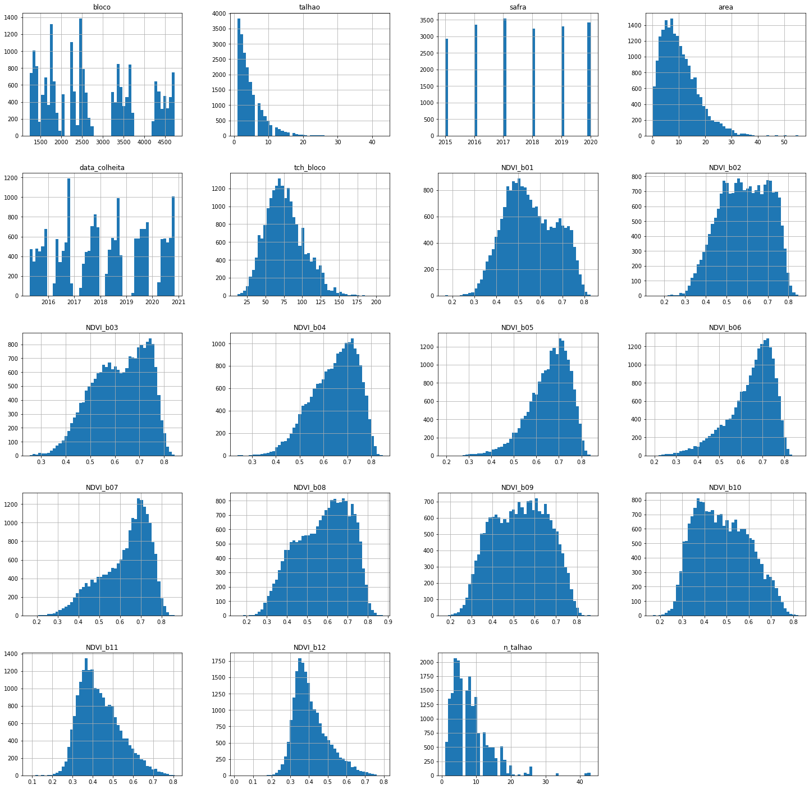
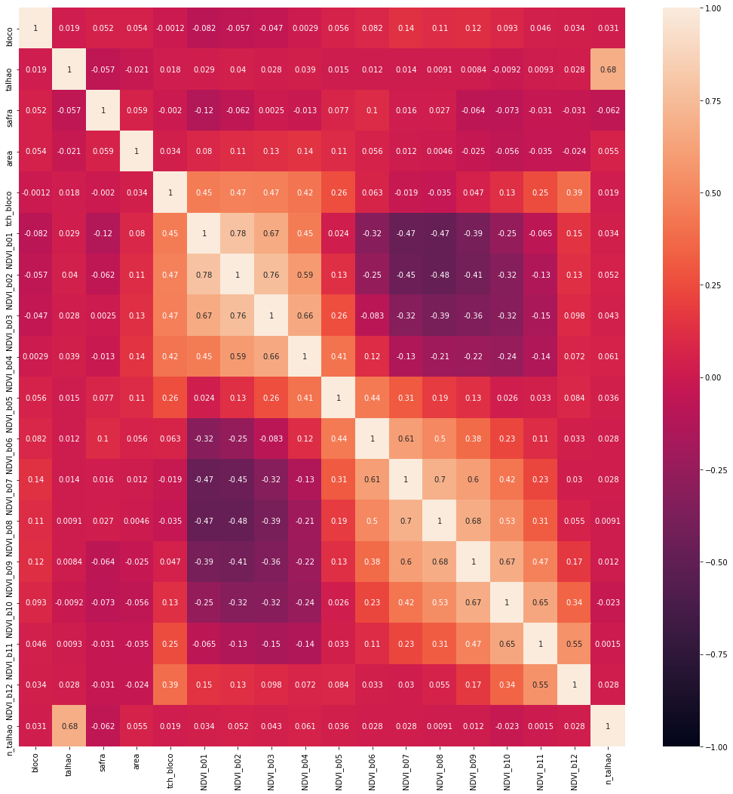

# Teste SpaceTime Labs

----

## Questão 1


```python
def conta_ruas_lockdown(N, A, B):
    j=0
    for i in range(N+1)[1:]:
        j = (j+1) if any([i%A ==0,i%B == 0]) else j
    return j
```


```python
print(conta_ruas_lockdown(10, 2, 3))
print(conta_ruas_lockdown(50, 5, 7))
print(conta_ruas_lockdown(1000000, 28, 32))
```

    7
    16
    62500


------

## Questão 2

**Descrição do dataset**:

* bloco: identificador da região de plantação e colheita de cana de açúcar
* talhao: identificador da sub-região de plantação e colheita de cana de açúcar (um bloco contém vários
talhões)
* safra: ano que a cana de açúcar foi colhida
* area: tamanho da área colhida em hectares
* data_colheita: data em que a cana de açúcar foi colhida
* tch_bloco: Toneladas de Cana por Hectare colhida referente ao bloco
* NDVI_b01: NDVI (Normalized De Vegetation Index), e o “b01” corresponde ao índice médio relativo ao primeiro mês antes da colheita
* NDVI_bN: NDVI médio relativo ao N-ésimo mês antes da colheita

**Objetivo do projeto**: Desenvolver um modelo capaz de prever o TCH dos blocos do dataset para a safra de 2021.

## Importação dos dados


```python
import pandas as pd
import numpy as np
import matplotlib.pyplot as plt
import seaborn as sns
import warnings
import datetime as dt
warnings.simplefilter("ignore")
pd.set_option('display.max_rows', 115)
```


```python
df = pd.read_csv(r'/Users/leuzinger/Dropbox/Data Science/Case SpaceTime Labs/dataset_case_DS.csv')
```


```python
df.head()
```


<div>
<style scoped>
    .dataframe tbody tr th:only-of-type {
        vertical-align: middle;
    }

    .dataframe tbody tr th {
        vertical-align: top;
    }

    .dataframe thead th {
        text-align: right;
    }
</style>
<table border="1" class="dataframe">
  <thead>
    <tr style="text-align: right;">
      <th></th>
      <th>Unnamed: 0</th>
      <th>bloco</th>
      <th>talhao</th>
      <th>safra</th>
      <th>area</th>
      <th>data_colheita</th>
      <th>tch_bloco</th>
      <th>NDVI_b01</th>
      <th>NDVI_b02</th>
      <th>NDVI_b03</th>
      <th>NDVI_b04</th>
      <th>NDVI_b05</th>
      <th>NDVI_b06</th>
      <th>NDVI_b07</th>
      <th>NDVI_b08</th>
      <th>NDVI_b09</th>
      <th>NDVI_b10</th>
      <th>NDVI_b11</th>
      <th>NDVI_b12</th>
    </tr>
  </thead>
  <tbody>
    <tr>
      <th>0</th>
      <td>0</td>
      <td>1239</td>
      <td>1</td>
      <td>2015</td>
      <td>15.53</td>
      <td>2015-10-25 00:00:00</td>
      <td>75.88</td>
      <td>0.622972</td>
      <td>NaN</td>
      <td>0.712402</td>
      <td>0.693089</td>
      <td>0.743105</td>
      <td>0.805768</td>
      <td>0.711357</td>
      <td>0.767734</td>
      <td>0.650449</td>
      <td>NaN</td>
      <td>0.241302</td>
      <td>NaN</td>
    </tr>
    <tr>
      <th>1</th>
      <td>1</td>
      <td>1243</td>
      <td>1</td>
      <td>2015</td>
      <td>13.69</td>
      <td>2015-07-14 00:00:00</td>
      <td>65.22</td>
      <td>0.677335</td>
      <td>NaN</td>
      <td>0.651432</td>
      <td>NaN</td>
      <td>0.721786</td>
      <td>0.641068</td>
      <td>NaN</td>
      <td>0.337117</td>
      <td>0.323262</td>
      <td>0.289830</td>
      <td>0.279747</td>
      <td>0.262570</td>
    </tr>
    <tr>
      <th>2</th>
      <td>2</td>
      <td>1243</td>
      <td>2</td>
      <td>2015</td>
      <td>4.63</td>
      <td>2015-07-15 00:00:00</td>
      <td>65.22</td>
      <td>0.632256</td>
      <td>NaN</td>
      <td>0.736531</td>
      <td>0.560717</td>
      <td>0.682829</td>
      <td>0.582140</td>
      <td>NaN</td>
      <td>0.317600</td>
      <td>0.298278</td>
      <td>NaN</td>
      <td>NaN</td>
      <td>NaN</td>
    </tr>
    <tr>
      <th>3</th>
      <td>3</td>
      <td>1243</td>
      <td>7</td>
      <td>2015</td>
      <td>4.95</td>
      <td>2015-07-16 00:00:00</td>
      <td>65.22</td>
      <td>0.570271</td>
      <td>0.463221</td>
      <td>0.702480</td>
      <td>0.590163</td>
      <td>0.664030</td>
      <td>0.602534</td>
      <td>NaN</td>
      <td>0.386727</td>
      <td>0.321662</td>
      <td>NaN</td>
      <td>NaN</td>
      <td>NaN</td>
    </tr>
    <tr>
      <th>4</th>
      <td>4</td>
      <td>1244</td>
      <td>4</td>
      <td>2015</td>
      <td>8.66</td>
      <td>2015-05-13 00:00:00</td>
      <td>96.91</td>
      <td>0.709576</td>
      <td>0.454723</td>
      <td>0.734945</td>
      <td>0.722006</td>
      <td>NaN</td>
      <td>0.494456</td>
      <td>0.401426</td>
      <td>0.364672</td>
      <td>0.367147</td>
      <td>0.387163</td>
      <td>0.452122</td>
      <td>0.516717</td>
    </tr>
  </tbody>
</table>
</div>


```python
df.info()
```

    <class 'pandas.core.frame.DataFrame'>
    RangeIndex: 19870 entries, 0 to 19869
    Data columns (total 19 columns):
     #   Column         Non-Null Count  Dtype  
    ---  ------         --------------  -----  
     0   Unnamed: 0     19870 non-null  int64  
     1   bloco          19870 non-null  int64  
     2   talhao         19870 non-null  int64  
     3   safra          19870 non-null  int64  
     4   area           16330 non-null  float64
     5   data_colheita  19755 non-null  object 
     6   tch_bloco      19838 non-null  float64
     7   NDVI_b01       18949 non-null  float64
     8   NDVI_b02       18829 non-null  float64
     9   NDVI_b03       18290 non-null  float64
     10  NDVI_b04       17487 non-null  float64
     11  NDVI_b05       16307 non-null  float64
     12  NDVI_b06       16422 non-null  float64
     13  NDVI_b07       16337 non-null  float64
     14  NDVI_b08       15798 non-null  float64
     15  NDVI_b09       15120 non-null  float64
     16  NDVI_b10       14647 non-null  float64
     17  NDVI_b11       13008 non-null  float64
     18  NDVI_b12       11628 non-null  float64
    dtypes: float64(14), int64(4), object(1)
    memory usage: 2.9+ MB


```python
df = df.drop('Unnamed: 0',axis=1)
df['data_colheita'] = pd.to_datetime(df['data_colheita'])
df.info()
```

    <class 'pandas.core.frame.DataFrame'>
    RangeIndex: 19870 entries, 0 to 19869
    Data columns (total 18 columns):
     #   Column         Non-Null Count  Dtype         
    ---  ------         --------------  -----         
     0   bloco          19870 non-null  int64         
     1   talhao         19870 non-null  int64         
     2   safra          19870 non-null  int64         
     3   area           16330 non-null  float64       
     4   data_colheita  19755 non-null  datetime64[ns]
     5   tch_bloco      19838 non-null  float64       
     6   NDVI_b01       18949 non-null  float64       
     7   NDVI_b02       18829 non-null  float64       
     8   NDVI_b03       18290 non-null  float64       
     9   NDVI_b04       17487 non-null  float64       
     10  NDVI_b05       16307 non-null  float64       
     11  NDVI_b06       16422 non-null  float64       
     12  NDVI_b07       16337 non-null  float64       
     13  NDVI_b08       15798 non-null  float64       
     14  NDVI_b09       15120 non-null  float64       
     15  NDVI_b10       14647 non-null  float64       
     16  NDVI_b11       13008 non-null  float64       
     17  NDVI_b12       11628 non-null  float64       
    dtypes: datetime64[ns](1), float64(14), int64(3)
    memory usage: 2.7 MB


```python
df.head()
```


<div>
<style scoped>
    .dataframe tbody tr th:only-of-type {
        vertical-align: middle;
    }

    .dataframe tbody tr th {
        vertical-align: top;
    }

    .dataframe thead th {
        text-align: right;
    }
</style>
<table border="1" class="dataframe">
  <thead>
    <tr style="text-align: right;">
      <th></th>
      <th>bloco</th>
      <th>talhao</th>
      <th>safra</th>
      <th>area</th>
      <th>data_colheita</th>
      <th>tch_bloco</th>
      <th>NDVI_b01</th>
      <th>NDVI_b02</th>
      <th>NDVI_b03</th>
      <th>NDVI_b04</th>
      <th>NDVI_b05</th>
      <th>NDVI_b06</th>
      <th>NDVI_b07</th>
      <th>NDVI_b08</th>
      <th>NDVI_b09</th>
      <th>NDVI_b10</th>
      <th>NDVI_b11</th>
      <th>NDVI_b12</th>
    </tr>
  </thead>
  <tbody>
    <tr>
      <th>0</th>
      <td>1239</td>
      <td>1</td>
      <td>2015</td>
      <td>15.53</td>
      <td>2015-10-25</td>
      <td>75.88</td>
      <td>0.622972</td>
      <td>NaN</td>
      <td>0.712402</td>
      <td>0.693089</td>
      <td>0.743105</td>
      <td>0.805768</td>
      <td>0.711357</td>
      <td>0.767734</td>
      <td>0.650449</td>
      <td>NaN</td>
      <td>0.241302</td>
      <td>NaN</td>
    </tr>
    <tr>
      <th>1</th>
      <td>1243</td>
      <td>1</td>
      <td>2015</td>
      <td>13.69</td>
      <td>2015-07-14</td>
      <td>65.22</td>
      <td>0.677335</td>
      <td>NaN</td>
      <td>0.651432</td>
      <td>NaN</td>
      <td>0.721786</td>
      <td>0.641068</td>
      <td>NaN</td>
      <td>0.337117</td>
      <td>0.323262</td>
      <td>0.289830</td>
      <td>0.279747</td>
      <td>0.262570</td>
    </tr>
    <tr>
      <th>2</th>
      <td>1243</td>
      <td>2</td>
      <td>2015</td>
      <td>4.63</td>
      <td>2015-07-15</td>
      <td>65.22</td>
      <td>0.632256</td>
      <td>NaN</td>
      <td>0.736531</td>
      <td>0.560717</td>
      <td>0.682829</td>
      <td>0.582140</td>
      <td>NaN</td>
      <td>0.317600</td>
      <td>0.298278</td>
      <td>NaN</td>
      <td>NaN</td>
      <td>NaN</td>
    </tr>
    <tr>
      <th>3</th>
      <td>1243</td>
      <td>7</td>
      <td>2015</td>
      <td>4.95</td>
      <td>2015-07-16</td>
      <td>65.22</td>
      <td>0.570271</td>
      <td>0.463221</td>
      <td>0.702480</td>
      <td>0.590163</td>
      <td>0.664030</td>
      <td>0.602534</td>
      <td>NaN</td>
      <td>0.386727</td>
      <td>0.321662</td>
      <td>NaN</td>
      <td>NaN</td>
      <td>NaN</td>
    </tr>
    <tr>
      <th>4</th>
      <td>1244</td>
      <td>4</td>
      <td>2015</td>
      <td>8.66</td>
      <td>2015-05-13</td>
      <td>96.91</td>
      <td>0.709576</td>
      <td>0.454723</td>
      <td>0.734945</td>
      <td>0.722006</td>
      <td>NaN</td>
      <td>0.494456</td>
      <td>0.401426</td>
      <td>0.364672</td>
      <td>0.367147</td>
      <td>0.387163</td>
      <td>0.452122</td>
      <td>0.516717</td>
    </tr>
  </tbody>
</table>
</div>


------

## Limpeza dos dados

Antes de começar a análise do dataset, vamos limpar os dados.


```python
df.isnull().sum()
```


    bloco               0
    talhao              0
    safra               0
    area             3540
    data_colheita     115
    tch_bloco          32
    NDVI_b01          921
    NDVI_b02         1041
    NDVI_b03         1580
    NDVI_b04         2383
    NDVI_b05         3563
    NDVI_b06         3448
    NDVI_b07         3533
    NDVI_b08         4072
    NDVI_b09         4750
    NDVI_b10         5223
    NDVI_b11         6862
    NDVI_b12         8242
    dtype: int64


---

Verificamos que o dataset tem muitos valores em branco. Antes de decidir o que fazer com estes valores, é preciso examiná-los.

---


```python
lista = df[(df.area.isnull()==True)]['bloco'].unique()
df[df.bloco.isin(lista)].sort_values(['bloco','talhao'])[:10]
```


<div>
<style scoped>
    .dataframe tbody tr th:only-of-type {
        vertical-align: middle;
    }

    .dataframe tbody tr th {
        vertical-align: top;
    }

    .dataframe thead th {
        text-align: right;
    }
</style>
<table border="1" class="dataframe">
  <thead>
    <tr style="text-align: right;">
      <th></th>
      <th>bloco</th>
      <th>talhao</th>
      <th>safra</th>
      <th>area</th>
      <th>data_colheita</th>
      <th>tch_bloco</th>
      <th>NDVI_b01</th>
      <th>NDVI_b02</th>
      <th>NDVI_b03</th>
      <th>NDVI_b04</th>
      <th>NDVI_b05</th>
      <th>NDVI_b06</th>
      <th>NDVI_b07</th>
      <th>NDVI_b08</th>
      <th>NDVI_b09</th>
      <th>NDVI_b10</th>
      <th>NDVI_b11</th>
      <th>NDVI_b12</th>
    </tr>
  </thead>
  <tbody>
    <tr>
      <th>4643</th>
      <td>1236</td>
      <td>1</td>
      <td>2016</td>
      <td>6.43</td>
      <td>2016-07-12</td>
      <td>101.68</td>
      <td>0.660357</td>
      <td>0.712407</td>
      <td>0.682959</td>
      <td>NaN</td>
      <td>0.378934</td>
      <td>NaN</td>
      <td>NaN</td>
      <td>0.432385</td>
      <td>0.589786</td>
      <td>0.564760</td>
      <td>NaN</td>
      <td>NaN</td>
    </tr>
    <tr>
      <th>8080</th>
      <td>1236</td>
      <td>1</td>
      <td>2017</td>
      <td>6.43</td>
      <td>2017-07-23</td>
      <td>86.43</td>
      <td>0.359089</td>
      <td>0.683225</td>
      <td>0.570371</td>
      <td>0.722969</td>
      <td>0.792568</td>
      <td>NaN</td>
      <td>NaN</td>
      <td>NaN</td>
      <td>0.589414</td>
      <td>0.467347</td>
      <td>0.446032</td>
      <td>0.297526</td>
    </tr>
    <tr>
      <th>11419</th>
      <td>1236</td>
      <td>1</td>
      <td>2018</td>
      <td>6.22</td>
      <td>2018-07-27</td>
      <td>60.10</td>
      <td>0.509706</td>
      <td>0.553962</td>
      <td>0.648584</td>
      <td>0.738972</td>
      <td>0.792210</td>
      <td>0.780096</td>
      <td>NaN</td>
      <td>0.656676</td>
      <td>0.438491</td>
      <td>0.348275</td>
      <td>0.286659</td>
      <td>0.285387</td>
    </tr>
    <tr>
      <th>14748</th>
      <td>1236</td>
      <td>1</td>
      <td>2019</td>
      <td>6.43</td>
      <td>2019-07-12</td>
      <td>69.18</td>
      <td>0.641126</td>
      <td>0.699486</td>
      <td>0.750493</td>
      <td>0.690155</td>
      <td>0.746051</td>
      <td>0.662154</td>
      <td>0.673212</td>
      <td>0.534159</td>
      <td>0.342282</td>
      <td>0.267040</td>
      <td>0.257505</td>
      <td>NaN</td>
    </tr>
    <tr>
      <th>16445</th>
      <td>1236</td>
      <td>1</td>
      <td>2020</td>
      <td>NaN</td>
      <td>2020-10-04</td>
      <td>51.90</td>
      <td>0.384249</td>
      <td>NaN</td>
      <td>0.479729</td>
      <td>0.564533</td>
      <td>0.629845</td>
      <td>0.717385</td>
      <td>0.729278</td>
      <td>NaN</td>
      <td>0.660739</td>
      <td>NaN</td>
      <td>0.460468</td>
      <td>0.383685</td>
    </tr>
    <tr>
      <th>3800</th>
      <td>1236</td>
      <td>2</td>
      <td>2016</td>
      <td>3.42</td>
      <td>2016-07-06</td>
      <td>101.68</td>
      <td>0.628659</td>
      <td>0.628896</td>
      <td>0.617167</td>
      <td>0.527482</td>
      <td>0.611054</td>
      <td>NaN</td>
      <td>NaN</td>
      <td>0.371698</td>
      <td>0.383678</td>
      <td>0.318137</td>
      <td>NaN</td>
      <td>NaN</td>
    </tr>
    <tr>
      <th>7207</th>
      <td>1236</td>
      <td>2</td>
      <td>2017</td>
      <td>3.42</td>
      <td>2017-11-10</td>
      <td>86.43</td>
      <td>0.423355</td>
      <td>0.425829</td>
      <td>0.460654</td>
      <td>0.487857</td>
      <td>0.530614</td>
      <td>0.552597</td>
      <td>0.587656</td>
      <td>0.648282</td>
      <td>NaN</td>
      <td>0.549427</td>
      <td>NaN</td>
      <td>NaN</td>
    </tr>
    <tr>
      <th>10616</th>
      <td>1236</td>
      <td>2</td>
      <td>2018</td>
      <td>3.42</td>
      <td>2018-07-25</td>
      <td>60.10</td>
      <td>0.479539</td>
      <td>0.412658</td>
      <td>0.575260</td>
      <td>0.624209</td>
      <td>0.661809</td>
      <td>0.597908</td>
      <td>NaN</td>
      <td>0.315461</td>
      <td>NaN</td>
      <td>NaN</td>
      <td>NaN</td>
      <td>NaN</td>
    </tr>
    <tr>
      <th>13917</th>
      <td>1236</td>
      <td>2</td>
      <td>2019</td>
      <td>3.42</td>
      <td>2019-07-11</td>
      <td>69.18</td>
      <td>0.555392</td>
      <td>0.616084</td>
      <td>0.650106</td>
      <td>0.632419</td>
      <td>0.631893</td>
      <td>0.557860</td>
      <td>0.563994</td>
      <td>0.446160</td>
      <td>0.328467</td>
      <td>0.301652</td>
      <td>0.289698</td>
      <td>NaN</td>
    </tr>
    <tr>
      <th>16446</th>
      <td>1236</td>
      <td>2</td>
      <td>2020</td>
      <td>NaN</td>
      <td>2020-11-05</td>
      <td>51.90</td>
      <td>0.167690</td>
      <td>0.357762</td>
      <td>0.373363</td>
      <td>0.407766</td>
      <td>0.482634</td>
      <td>0.481337</td>
      <td>0.547575</td>
      <td>0.539551</td>
      <td>0.591749</td>
      <td>0.538537</td>
      <td>NaN</td>
      <td>0.381633</td>
    </tr>
  </tbody>
</table>
</div>


```python
lista = df[(df.data_colheita.isnull()==True)]['bloco'].unique()
df[df.bloco.isin(lista)].sort_values(['bloco','talhao'])[:10]
```


<div>
<style scoped>
    .dataframe tbody tr th:only-of-type {
        vertical-align: middle;
    }

    .dataframe tbody tr th {
        vertical-align: top;
    }

    .dataframe thead th {
        text-align: right;
    }
</style>
<table border="1" class="dataframe">
  <thead>
    <tr style="text-align: right;">
      <th></th>
      <th>bloco</th>
      <th>talhao</th>
      <th>safra</th>
      <th>area</th>
      <th>data_colheita</th>
      <th>tch_bloco</th>
      <th>NDVI_b01</th>
      <th>NDVI_b02</th>
      <th>NDVI_b03</th>
      <th>NDVI_b04</th>
      <th>NDVI_b05</th>
      <th>NDVI_b06</th>
      <th>NDVI_b07</th>
      <th>NDVI_b08</th>
      <th>NDVI_b09</th>
      <th>NDVI_b10</th>
      <th>NDVI_b11</th>
      <th>NDVI_b12</th>
    </tr>
  </thead>
  <tbody>
    <tr>
      <th>3393</th>
      <td>1318</td>
      <td>1</td>
      <td>2016</td>
      <td>7.86</td>
      <td>2016-10-24</td>
      <td>46.46</td>
      <td>0.541005</td>
      <td>NaN</td>
      <td>0.543375</td>
      <td>0.624938</td>
      <td>0.664672</td>
      <td>0.619579</td>
      <td>0.650427</td>
      <td>0.587982</td>
      <td>0.635573</td>
      <td>NaN</td>
      <td>NaN</td>
      <td>NaN</td>
    </tr>
    <tr>
      <th>10225</th>
      <td>1318</td>
      <td>1</td>
      <td>2018</td>
      <td>6.46</td>
      <td>2018-07-08</td>
      <td>139.39</td>
      <td>0.667255</td>
      <td>0.714403</td>
      <td>0.753384</td>
      <td>0.756028</td>
      <td>0.673907</td>
      <td>0.739257</td>
      <td>0.581891</td>
      <td>0.662200</td>
      <td>0.611078</td>
      <td>0.608620</td>
      <td>0.677862</td>
      <td>0.672090</td>
    </tr>
    <tr>
      <th>13463</th>
      <td>1318</td>
      <td>1</td>
      <td>2019</td>
      <td>NaN</td>
      <td>NaT</td>
      <td>94.25</td>
      <td>0.733818</td>
      <td>0.742121</td>
      <td>0.750504</td>
      <td>0.709293</td>
      <td>0.692059</td>
      <td>NaN</td>
      <td>0.504185</td>
      <td>0.371439</td>
      <td>0.320846</td>
      <td>0.299756</td>
      <td>NaN</td>
      <td>NaN</td>
    </tr>
    <tr>
      <th>16565</th>
      <td>1318</td>
      <td>1</td>
      <td>2020</td>
      <td>NaN</td>
      <td>2020-10-22</td>
      <td>84.50</td>
      <td>0.408857</td>
      <td>0.396095</td>
      <td>0.472941</td>
      <td>0.490616</td>
      <td>0.529498</td>
      <td>0.558046</td>
      <td>0.633011</td>
      <td>0.707958</td>
      <td>NaN</td>
      <td>0.671246</td>
      <td>NaN</td>
      <td>0.448816</td>
    </tr>
    <tr>
      <th>3819</th>
      <td>1318</td>
      <td>2</td>
      <td>2016</td>
      <td>2.51</td>
      <td>2016-10-22</td>
      <td>46.46</td>
      <td>0.538544</td>
      <td>NaN</td>
      <td>0.588504</td>
      <td>0.621241</td>
      <td>0.671270</td>
      <td>0.608038</td>
      <td>0.652931</td>
      <td>0.641752</td>
      <td>0.399441</td>
      <td>NaN</td>
      <td>NaN</td>
      <td>NaN</td>
    </tr>
    <tr>
      <th>12202</th>
      <td>1318</td>
      <td>2</td>
      <td>2018</td>
      <td>7.81</td>
      <td>2018-07-08</td>
      <td>139.39</td>
      <td>0.696029</td>
      <td>0.733771</td>
      <td>0.766465</td>
      <td>0.766945</td>
      <td>0.662892</td>
      <td>0.757443</td>
      <td>0.523213</td>
      <td>0.649017</td>
      <td>0.603544</td>
      <td>0.616227</td>
      <td>0.680219</td>
      <td>0.667862</td>
    </tr>
    <tr>
      <th>15630</th>
      <td>1318</td>
      <td>2</td>
      <td>2019</td>
      <td>NaN</td>
      <td>NaT</td>
      <td>94.25</td>
      <td>0.712241</td>
      <td>0.745143</td>
      <td>0.734060</td>
      <td>0.681058</td>
      <td>0.668439</td>
      <td>NaN</td>
      <td>0.511120</td>
      <td>0.361319</td>
      <td>0.314161</td>
      <td>0.285863</td>
      <td>NaN</td>
      <td>NaN</td>
    </tr>
    <tr>
      <th>16566</th>
      <td>1318</td>
      <td>2</td>
      <td>2020</td>
      <td>NaN</td>
      <td>2020-10-18</td>
      <td>84.50</td>
      <td>0.409168</td>
      <td>0.398943</td>
      <td>0.473986</td>
      <td>0.536752</td>
      <td>0.517132</td>
      <td>0.655842</td>
      <td>0.694097</td>
      <td>0.741326</td>
      <td>NaN</td>
      <td>0.684743</td>
      <td>NaN</td>
      <td>0.471911</td>
    </tr>
    <tr>
      <th>5891</th>
      <td>1318</td>
      <td>3</td>
      <td>2016</td>
      <td>4.03</td>
      <td>2016-10-24</td>
      <td>46.46</td>
      <td>0.520981</td>
      <td>NaN</td>
      <td>0.542252</td>
      <td>0.590789</td>
      <td>0.663539</td>
      <td>0.579616</td>
      <td>0.657354</td>
      <td>0.563013</td>
      <td>0.426595</td>
      <td>NaN</td>
      <td>NaN</td>
      <td>NaN</td>
    </tr>
    <tr>
      <th>10226</th>
      <td>1318</td>
      <td>3</td>
      <td>2018</td>
      <td>5.30</td>
      <td>2018-07-09</td>
      <td>139.39</td>
      <td>0.682254</td>
      <td>0.724838</td>
      <td>0.766900</td>
      <td>0.774900</td>
      <td>0.668060</td>
      <td>0.750179</td>
      <td>0.496373</td>
      <td>0.604408</td>
      <td>0.532426</td>
      <td>0.561839</td>
      <td>0.633349</td>
      <td>0.619208</td>
    </tr>
  </tbody>
</table>
</div>


```python
lista = df[(df.tch_bloco.isnull()==True)]['bloco'].unique()
df[df.bloco.isin(lista)].sort_values(['bloco','talhao'])[:10]
```


<div>
<style scoped>
    .dataframe tbody tr th:only-of-type {
        vertical-align: middle;
    }

    .dataframe tbody tr th {
        vertical-align: top;
    }

    .dataframe thead th {
        text-align: right;
    }
</style>
<table border="1" class="dataframe">
  <thead>
    <tr style="text-align: right;">
      <th></th>
      <th>bloco</th>
      <th>talhao</th>
      <th>safra</th>
      <th>area</th>
      <th>data_colheita</th>
      <th>tch_bloco</th>
      <th>NDVI_b01</th>
      <th>NDVI_b02</th>
      <th>NDVI_b03</th>
      <th>NDVI_b04</th>
      <th>NDVI_b05</th>
      <th>NDVI_b06</th>
      <th>NDVI_b07</th>
      <th>NDVI_b08</th>
      <th>NDVI_b09</th>
      <th>NDVI_b10</th>
      <th>NDVI_b11</th>
      <th>NDVI_b12</th>
    </tr>
  </thead>
  <tbody>
    <tr>
      <th>1515</th>
      <td>1357</td>
      <td>1</td>
      <td>2015</td>
      <td>8.64</td>
      <td>2015-06-12</td>
      <td>104.28</td>
      <td>0.560011</td>
      <td>0.723784</td>
      <td>NaN</td>
      <td>0.753860</td>
      <td>0.739095</td>
      <td>0.574669</td>
      <td>0.465178</td>
      <td>0.442331</td>
      <td>0.425564</td>
      <td>0.509961</td>
      <td>0.473171</td>
      <td>0.465006</td>
    </tr>
    <tr>
      <th>4660</th>
      <td>1357</td>
      <td>1</td>
      <td>2016</td>
      <td>8.92</td>
      <td>2016-07-25</td>
      <td>80.75</td>
      <td>0.645183</td>
      <td>0.689671</td>
      <td>0.671252</td>
      <td>0.711323</td>
      <td>NaN</td>
      <td>0.521723</td>
      <td>NaN</td>
      <td>NaN</td>
      <td>NaN</td>
      <td>0.459200</td>
      <td>0.401939</td>
      <td>0.328257</td>
    </tr>
    <tr>
      <th>8108</th>
      <td>1357</td>
      <td>1</td>
      <td>2017</td>
      <td>8.92</td>
      <td>2017-09-17</td>
      <td>61.97</td>
      <td>0.561801</td>
      <td>0.605856</td>
      <td>0.715280</td>
      <td>0.694626</td>
      <td>0.645020</td>
      <td>0.714974</td>
      <td>0.676409</td>
      <td>0.754707</td>
      <td>0.594936</td>
      <td>0.512324</td>
      <td>0.476257</td>
      <td>0.339432</td>
    </tr>
    <tr>
      <th>14771</th>
      <td>1357</td>
      <td>1</td>
      <td>2019</td>
      <td>NaN</td>
      <td>NaT</td>
      <td>NaN</td>
      <td>NaN</td>
      <td>0.448475</td>
      <td>NaN</td>
      <td>0.734450</td>
      <td>NaN</td>
      <td>0.663825</td>
      <td>0.395827</td>
      <td>0.371531</td>
      <td>0.377227</td>
      <td>0.457353</td>
      <td>0.474648</td>
      <td>0.508572</td>
    </tr>
    <tr>
      <th>16646</th>
      <td>1357</td>
      <td>1</td>
      <td>2020</td>
      <td>NaN</td>
      <td>2020-08-23</td>
      <td>92.70</td>
      <td>0.534981</td>
      <td>0.629003</td>
      <td>0.694800</td>
      <td>0.778286</td>
      <td>0.765914</td>
      <td>0.787156</td>
      <td>0.662749</td>
      <td>NaN</td>
      <td>NaN</td>
      <td>0.501623</td>
      <td>0.468881</td>
      <td>0.499989</td>
    </tr>
    <tr>
      <th>27</th>
      <td>1357</td>
      <td>2</td>
      <td>2015</td>
      <td>12.53</td>
      <td>2015-06-12</td>
      <td>104.28</td>
      <td>0.606405</td>
      <td>0.730581</td>
      <td>NaN</td>
      <td>0.770099</td>
      <td>0.759300</td>
      <td>0.537352</td>
      <td>0.494894</td>
      <td>0.480092</td>
      <td>0.470438</td>
      <td>0.540441</td>
      <td>0.510380</td>
      <td>0.500675</td>
    </tr>
    <tr>
      <th>2950</th>
      <td>1357</td>
      <td>2</td>
      <td>2016</td>
      <td>13.89</td>
      <td>2016-07-23</td>
      <td>80.75</td>
      <td>0.669249</td>
      <td>0.708285</td>
      <td>0.694450</td>
      <td>0.728916</td>
      <td>NaN</td>
      <td>0.530665</td>
      <td>NaN</td>
      <td>NaN</td>
      <td>NaN</td>
      <td>0.482191</td>
      <td>0.422526</td>
      <td>0.351897</td>
    </tr>
    <tr>
      <th>6310</th>
      <td>1357</td>
      <td>2</td>
      <td>2017</td>
      <td>13.89</td>
      <td>2017-09-17</td>
      <td>61.97</td>
      <td>0.600781</td>
      <td>0.637149</td>
      <td>0.733459</td>
      <td>0.698046</td>
      <td>0.657977</td>
      <td>0.737303</td>
      <td>0.705674</td>
      <td>0.764149</td>
      <td>0.597411</td>
      <td>0.527565</td>
      <td>0.492013</td>
      <td>0.366543</td>
    </tr>
    <tr>
      <th>13068</th>
      <td>1357</td>
      <td>2</td>
      <td>2019</td>
      <td>NaN</td>
      <td>NaT</td>
      <td>NaN</td>
      <td>NaN</td>
      <td>0.507056</td>
      <td>NaN</td>
      <td>0.750507</td>
      <td>NaN</td>
      <td>0.679439</td>
      <td>0.421968</td>
      <td>0.407366</td>
      <td>0.409763</td>
      <td>0.478562</td>
      <td>0.497599</td>
      <td>0.529751</td>
    </tr>
    <tr>
      <th>16647</th>
      <td>1357</td>
      <td>2</td>
      <td>2020</td>
      <td>NaN</td>
      <td>2020-08-24</td>
      <td>92.70</td>
      <td>0.569449</td>
      <td>0.650422</td>
      <td>0.708424</td>
      <td>0.780500</td>
      <td>0.763065</td>
      <td>0.792830</td>
      <td>0.709250</td>
      <td>NaN</td>
      <td>NaN</td>
      <td>0.556282</td>
      <td>0.494241</td>
      <td>0.511743</td>
    </tr>
  </tbody>
</table>
</div>


-------

Para o caso da data da colheita e do TCH do bloco, vemos que há poucas linhas do dataset que estão sem valor. Nestes casos, é melhor remover estas linhas do dataset. **Vamos considerar que este tipo de linha é um erro no dataset, pois não são significativos para nossa análise e representam apenas 0,6% dos dados**.

---


```python
df = df.dropna(subset=['data_colheita','tch_bloco']).reset_index(drop=True)
df.isnull().sum()
```


    bloco               0
    talhao              0
    safra               0
    area             3425
    data_colheita       0
    tch_bloco           0
    NDVI_b01          897
    NDVI_b02         1024
    NDVI_b03         1554
    NDVI_b04         2366
    NDVI_b05         3558
    NDVI_b06         3431
    NDVI_b07         3532
    NDVI_b08         4069
    NDVI_b09         4730
    NDVI_b10         5190
    NDVI_b11         6814
    NDVI_b12         8184
    dtype: int64


```python
df[(df.area.isnull()==True)]['safra'].unique()
```


    array([2020])


```python
df[(df.safra==2020)]['area'].unique()
```


    array([nan])


---

Após excluir as linhas, verificamos que todos os valores em branco referentes à variável 'área' são da safra de 2020. E o mais importante é que não temos nenhum valor de área para a safra de 2020. **O problema é que sem a área do talhão, não é possível estabelecer uma relação entre os valores que estão definidos no nível do talhão (área, data da colheita e NDVI) e o valor do TCH que está no nível do bloco**.

Se a área colhida fosse sempre a mesma em cada talhão ou em cada bloco, bastaria adotar esse valor. Contudo, não é esse o caso. Uma possível solução é utilizar imputações estatítisticas ou do tipo [KNN](https://scikit-learn.org/stable/modules/generated/sklearn.impute.KNNImputer.html) para estimar esse dado de área faltante. 

Logo, procederemos da seguinte forma:

1. imputaremos os valores de área mais frequentes para os talhoes que tiveram safras anteriores.
2. imputaremos a área média dos talhões do bloco para os talhões que não tiveram safras anteriores, mas fazem parte de um bloco.
3. imputaremos as áreas que ainda estiverem faltando usando o KNN imputer.

Além diso, antes da terceira imputação, criaremos a coluna n_talhao, que indica quantos talhões existem no bloco, para tentar melhorar o algoritmo.

Quanto aos valores em branco de NDVI, vamos usar também o KNN imputer para completar os dados, pois os modelos de ML não funcionarão caso estes valores estejam em branco.

----- 


```python
from sklearn.impute import SimpleImputer
dfi = df.copy()
imputer = SimpleImputer(strategy = 'most_frequent')
imputer2 = SimpleImputer(strategy = 'mean')
for i in dfi['bloco'].sort_values().unique():
    for j in df[df['bloco']==i]['talhao'].sort_values().unique():
        #print(i,j)
        if ((len(dfi[(dfi['bloco']==i)&(dfi['talhao']==j)]['area'])>1) &
            (np.isnan(dfi.iloc[dfi[(dfi['bloco']==i)&(dfi['talhao']==j)]['area'][-1:].index[0],3]))
           ):
            dfi.iloc[dfi[(dfi['bloco']==i)&(dfi['talhao']==j)]['area'][-1:].index[0],3] = imputer.fit_transform(dfi[(dfi['bloco']==i)&(dfi['talhao']==j)]['area'].to_frame())[-1,0]
    
    if ((dfi[(dfi['bloco']==i)&(dfi['safra']==2020)]['area'].isnull().sum()!=0) &
        (len(dfi[(dfi['bloco']==i)&(dfi['safra']==2020)]['area'])>1) &
        (dfi[(dfi['bloco']==i)&(dfi['safra']==2020)]['area'].sum()!=0)
       ):
        for k in range(len(dfi[(dfi['bloco']==i)&(dfi['safra']==2020)]['area'])):
            dfi.iloc[dfi[(dfi['bloco']==i)&(dfi['safra']==2020)]['area'].index[k],3] = imputer2.fit_transform(dfi[(dfi['bloco']==i)]['area'].to_frame())[k,0]
```


```python
dfi.isnull().sum()
```


    bloco               0
    talhao              0
    safra               0
    area              429
    data_colheita       0
    tch_bloco           0
    NDVI_b01          897
    NDVI_b02         1024
    NDVI_b03         1554
    NDVI_b04         2366
    NDVI_b05         3558
    NDVI_b06         3431
    NDVI_b07         3532
    NDVI_b08         4069
    NDVI_b09         4730
    NDVI_b10         5190
    NDVI_b11         6814
    NDVI_b12         8184
    dtype: int64


```python
dfi['n_talhao'] = dfi['talhao']
a = dfi.groupby(['bloco','safra']).count()['talhao'].reset_index()
for i in dfi['bloco'].sort_values().unique():
    for j in df[df['bloco']==i]['safra'].sort_values().unique():
        for k in range(len(dfi[(dfi['bloco']==i)&(dfi['safra']==j)]['n_talhao'])):
            dfi.iloc[dfi[(dfi['bloco']==i)&(dfi['safra']==j)]['n_talhao'].index[k],-1] = a.iloc[a[(a['bloco']==i)&(a['safra']==j)].index[0],2]
```


```python
from sklearn.impute import KNNImputer

dfii = dfi[['safra','area','tch_bloco','n_talhao']]

imputer = KNNImputer()
dfii = pd.DataFrame(imputer.fit_transform(dfii),columns = dfii.columns)
dfi['area'] = dfii['area']
```


```python
dfi.isnull().sum()
```


    bloco               0
    talhao              0
    safra               0
    area                0
    data_colheita       0
    tch_bloco           0
    NDVI_b01          897
    NDVI_b02         1024
    NDVI_b03         1554
    NDVI_b04         2366
    NDVI_b05         3558
    NDVI_b06         3431
    NDVI_b07         3532
    NDVI_b08         4069
    NDVI_b09         4730
    NDVI_b10         5190
    NDVI_b11         6814
    NDVI_b12         8184
    n_talhao            0
    dtype: int64


```python
dfii = dfi[['safra','area','data_colheita','tch_bloco','NDVI_b01', 'NDVI_b02', 'NDVI_b03', 'NDVI_b04', 'NDVI_b05', 'NDVI_b06',
       'NDVI_b07', 'NDVI_b08', 'NDVI_b09', 'NDVI_b10', 'NDVI_b11', 'NDVI_b12']]
dfii['data_colheita'] = dfii['data_colheita'].dt.month

imputer = KNNImputer()
dfii = pd.DataFrame(imputer.fit_transform(dfii),columns = dfii.columns)

dfi[['NDVI_b01','NDVI_b02','NDVI_b03','NDVI_b04','NDVI_b05','NDVI_b06','NDVI_b07','NDVI_b08','NDVI_b09',
     'NDVI_b10','NDVI_b11','NDVI_b12']] = dfii[['NDVI_b01','NDVI_b02','NDVI_b03','NDVI_b04','NDVI_b05',
                                                 'NDVI_b06','NDVI_b07','NDVI_b08','NDVI_b09','NDVI_b10',
                                                 'NDVI_b11','NDVI_b12']]
```


```python
dfi.isnull().sum()
```


    bloco            0
    talhao           0
    safra            0
    area             0
    data_colheita    0
    tch_bloco        0
    NDVI_b01         0
    NDVI_b02         0
    NDVI_b03         0
    NDVI_b04         0
    NDVI_b05         0
    NDVI_b06         0
    NDVI_b07         0
    NDVI_b08         0
    NDVI_b09         0
    NDVI_b10         0
    NDVI_b11         0
    NDVI_b12         0
    n_talhao         0
    dtype: int64


```python
df.describe()[['area','NDVI_b01', 'NDVI_b02', 'NDVI_b03', 'NDVI_b04', 'NDVI_b05', 'NDVI_b06',
       'NDVI_b07', 'NDVI_b08', 'NDVI_b09', 'NDVI_b10', 'NDVI_b11', 'NDVI_b12']]
```


<div>
<style scoped>
    .dataframe tbody tr th:only-of-type {
        vertical-align: middle;
    }

    .dataframe tbody tr th {
        vertical-align: top;
    }

    .dataframe thead th {
        text-align: right;
    }
</style>
<table border="1" class="dataframe">
  <thead>
    <tr style="text-align: right;">
      <th></th>
      <th>area</th>
      <th>NDVI_b01</th>
      <th>NDVI_b02</th>
      <th>NDVI_b03</th>
      <th>NDVI_b04</th>
      <th>NDVI_b05</th>
      <th>NDVI_b06</th>
      <th>NDVI_b07</th>
      <th>NDVI_b08</th>
      <th>NDVI_b09</th>
      <th>NDVI_b10</th>
      <th>NDVI_b11</th>
      <th>NDVI_b12</th>
    </tr>
  </thead>
  <tbody>
    <tr>
      <th>count</th>
      <td>16330.000000</td>
      <td>18858.000000</td>
      <td>18731.000000</td>
      <td>18201.000000</td>
      <td>17389.000000</td>
      <td>16197.000000</td>
      <td>16324.000000</td>
      <td>16223.000000</td>
      <td>15686.000000</td>
      <td>15025.000000</td>
      <td>14565.000000</td>
      <td>12941.000000</td>
      <td>11571.000000</td>
    </tr>
    <tr>
      <th>mean</th>
      <td>10.315681</td>
      <td>0.555198</td>
      <td>0.584408</td>
      <td>0.616019</td>
      <td>0.641219</td>
      <td>0.660380</td>
      <td>0.649698</td>
      <td>0.625652</td>
      <td>0.574281</td>
      <td>0.521855</td>
      <td>0.475510</td>
      <td>0.437605</td>
      <td>0.421976</td>
    </tr>
    <tr>
      <th>std</th>
      <td>7.014490</td>
      <td>0.116653</td>
      <td>0.119236</td>
      <td>0.111679</td>
      <td>0.099086</td>
      <td>0.093609</td>
      <td>0.109039</td>
      <td>0.123799</td>
      <td>0.136323</td>
      <td>0.136549</td>
      <td>0.126454</td>
      <td>0.112685</td>
      <td>0.107293</td>
    </tr>
    <tr>
      <th>min</th>
      <td>0.100000</td>
      <td>0.167690</td>
      <td>0.144434</td>
      <td>0.252998</td>
      <td>0.238391</td>
      <td>0.194337</td>
      <td>0.193197</td>
      <td>0.164646</td>
      <td>0.153519</td>
      <td>0.175709</td>
      <td>0.168284</td>
      <td>0.087098</td>
      <td>0.016624</td>
    </tr>
    <tr>
      <th>25%</th>
      <td>4.980000</td>
      <td>0.466742</td>
      <td>0.492269</td>
      <td>0.531234</td>
      <td>0.570376</td>
      <td>0.606408</td>
      <td>0.591299</td>
      <td>0.539239</td>
      <td>0.462159</td>
      <td>0.407593</td>
      <td>0.372263</td>
      <td>0.349010</td>
      <td>0.339028</td>
    </tr>
    <tr>
      <th>50%</th>
      <td>8.940000</td>
      <td>0.544128</td>
      <td>0.585129</td>
      <td>0.623090</td>
      <td>0.652993</td>
      <td>0.677149</td>
      <td>0.677435</td>
      <td>0.660488</td>
      <td>0.585325</td>
      <td>0.513960</td>
      <td>0.458715</td>
      <td>0.416971</td>
      <td>0.400721</td>
    </tr>
    <tr>
      <th>75%</th>
      <td>14.150000</td>
      <td>0.649843</td>
      <td>0.685274</td>
      <td>0.711634</td>
      <td>0.721150</td>
      <td>0.729874</td>
      <td>0.730545</td>
      <td>0.722528</td>
      <td>0.691985</td>
      <td>0.637376</td>
      <td>0.571464</td>
      <td>0.513400</td>
      <td>0.494742</td>
    </tr>
    <tr>
      <th>max</th>
      <td>55.330000</td>
      <td>0.827770</td>
      <td>0.847112</td>
      <td>0.843789</td>
      <td>0.848073</td>
      <td>0.840200</td>
      <td>0.864477</td>
      <td>0.864479</td>
      <td>0.873298</td>
      <td>0.863752</td>
      <td>0.822103</td>
      <td>0.807408</td>
      <td>0.793348</td>
    </tr>
  </tbody>
</table>
</div>


```python
dfi.describe()[['area','NDVI_b01', 'NDVI_b02', 'NDVI_b03', 'NDVI_b04', 'NDVI_b05', 'NDVI_b06',
       'NDVI_b07', 'NDVI_b08', 'NDVI_b09', 'NDVI_b10', 'NDVI_b11', 'NDVI_b12']]
```


<div>
<style scoped>
    .dataframe tbody tr th:only-of-type {
        vertical-align: middle;
    }

    .dataframe tbody tr th {
        vertical-align: top;
    }

    .dataframe thead th {
        text-align: right;
    }
</style>
<table border="1" class="dataframe">
  <thead>
    <tr style="text-align: right;">
      <th></th>
      <th>area</th>
      <th>NDVI_b01</th>
      <th>NDVI_b02</th>
      <th>NDVI_b03</th>
      <th>NDVI_b04</th>
      <th>NDVI_b05</th>
      <th>NDVI_b06</th>
      <th>NDVI_b07</th>
      <th>NDVI_b08</th>
      <th>NDVI_b09</th>
      <th>NDVI_b10</th>
      <th>NDVI_b11</th>
      <th>NDVI_b12</th>
    </tr>
  </thead>
  <tbody>
    <tr>
      <th>count</th>
      <td>19755.000000</td>
      <td>19755.000000</td>
      <td>19755.000000</td>
      <td>19755.000000</td>
      <td>19755.000000</td>
      <td>19755.000000</td>
      <td>19755.000000</td>
      <td>19755.000000</td>
      <td>19755.000000</td>
      <td>19755.000000</td>
      <td>19755.000000</td>
      <td>19755.000000</td>
      <td>19755.000000</td>
    </tr>
    <tr>
      <th>mean</th>
      <td>10.347039</td>
      <td>0.554465</td>
      <td>0.586974</td>
      <td>0.618711</td>
      <td>0.644996</td>
      <td>0.657405</td>
      <td>0.646210</td>
      <td>0.625638</td>
      <td>0.578792</td>
      <td>0.532422</td>
      <td>0.481837</td>
      <td>0.434496</td>
      <td>0.409794</td>
    </tr>
    <tr>
      <th>std</th>
      <td>6.951789</td>
      <td>0.116091</td>
      <td>0.118286</td>
      <td>0.110083</td>
      <td>0.095916</td>
      <td>0.090768</td>
      <td>0.105794</td>
      <td>0.117962</td>
      <td>0.129057</td>
      <td>0.129340</td>
      <td>0.120395</td>
      <td>0.101027</td>
      <td>0.092207</td>
    </tr>
    <tr>
      <th>min</th>
      <td>0.100000</td>
      <td>0.167690</td>
      <td>0.144434</td>
      <td>0.252998</td>
      <td>0.238391</td>
      <td>0.194337</td>
      <td>0.193197</td>
      <td>0.164646</td>
      <td>0.153519</td>
      <td>0.175709</td>
      <td>0.168284</td>
      <td>0.087098</td>
      <td>0.016624</td>
    </tr>
    <tr>
      <th>25%</th>
      <td>5.050000</td>
      <td>0.465436</td>
      <td>0.495208</td>
      <td>0.535895</td>
      <td>0.579041</td>
      <td>0.604324</td>
      <td>0.588632</td>
      <td>0.547703</td>
      <td>0.477719</td>
      <td>0.426183</td>
      <td>0.382788</td>
      <td>0.358429</td>
      <td>0.344557</td>
    </tr>
    <tr>
      <th>50%</th>
      <td>9.010000</td>
      <td>0.543233</td>
      <td>0.589661</td>
      <td>0.628132</td>
      <td>0.658793</td>
      <td>0.672151</td>
      <td>0.670628</td>
      <td>0.656294</td>
      <td>0.594255</td>
      <td>0.535359</td>
      <td>0.471934</td>
      <td>0.417920</td>
      <td>0.389449</td>
    </tr>
    <tr>
      <th>75%</th>
      <td>14.160000</td>
      <td>0.648263</td>
      <td>0.687025</td>
      <td>0.711854</td>
      <td>0.720391</td>
      <td>0.724530</td>
      <td>0.724974</td>
      <td>0.716223</td>
      <td>0.684227</td>
      <td>0.637570</td>
      <td>0.574345</td>
      <td>0.498332</td>
      <td>0.459478</td>
    </tr>
    <tr>
      <th>max</th>
      <td>55.330000</td>
      <td>0.827770</td>
      <td>0.847112</td>
      <td>0.843789</td>
      <td>0.848073</td>
      <td>0.840200</td>
      <td>0.864477</td>
      <td>0.864479</td>
      <td>0.873298</td>
      <td>0.863752</td>
      <td>0.822103</td>
      <td>0.807408</td>
      <td>0.793348</td>
    </tr>
  </tbody>
</table>
</div>


```python
df = dfi
```

----

**Verificamos que para nenhuma das variáveis as imputações mudaram significativamente as estatísticas do dataset, o que indica que as imputações estão coerentes**.

------

## Análise exploratória

Para iniciar a análise exploratória, vamos olhar para algumas estatísticas dos dados.


```python
df.describe()
```


<div>
<style scoped>
    .dataframe tbody tr th:only-of-type {
        vertical-align: middle;
    }

    .dataframe tbody tr th {
        vertical-align: top;
    }

    .dataframe thead th {
        text-align: right;
    }
</style>
<table border="1" class="dataframe">
  <thead>
    <tr style="text-align: right;">
      <th></th>
      <th>bloco</th>
      <th>talhao</th>
      <th>safra</th>
      <th>area</th>
      <th>tch_bloco</th>
      <th>NDVI_b01</th>
      <th>NDVI_b02</th>
      <th>NDVI_b03</th>
      <th>NDVI_b04</th>
      <th>NDVI_b05</th>
      <th>NDVI_b06</th>
      <th>NDVI_b07</th>
      <th>NDVI_b08</th>
      <th>NDVI_b09</th>
      <th>NDVI_b10</th>
      <th>NDVI_b11</th>
      <th>NDVI_b12</th>
      <th>n_talhao</th>
    </tr>
  </thead>
  <tbody>
    <tr>
      <th>count</th>
      <td>19755.000000</td>
      <td>19755.000000</td>
      <td>19755.000000</td>
      <td>19755.000000</td>
      <td>19755.000000</td>
      <td>19755.000000</td>
      <td>19755.000000</td>
      <td>19755.000000</td>
      <td>19755.000000</td>
      <td>19755.000000</td>
      <td>19755.000000</td>
      <td>19755.000000</td>
      <td>19755.000000</td>
      <td>19755.000000</td>
      <td>19755.000000</td>
      <td>19755.000000</td>
      <td>19755.000000</td>
      <td>19755.000000</td>
    </tr>
    <tr>
      <th>mean</th>
      <td>2742.280992</td>
      <td>4.647127</td>
      <td>2017.551253</td>
      <td>10.347039</td>
      <td>76.365356</td>
      <td>0.554465</td>
      <td>0.586974</td>
      <td>0.618711</td>
      <td>0.644996</td>
      <td>0.657405</td>
      <td>0.646210</td>
      <td>0.625638</td>
      <td>0.578792</td>
      <td>0.532422</td>
      <td>0.481837</td>
      <td>0.434496</td>
      <td>0.409794</td>
      <td>8.011794</td>
    </tr>
    <tr>
      <th>std</th>
      <td>1092.827862</td>
      <td>3.989844</td>
      <td>1.687594</td>
      <td>6.951789</td>
      <td>25.924591</td>
      <td>0.116091</td>
      <td>0.118286</td>
      <td>0.110083</td>
      <td>0.095916</td>
      <td>0.090768</td>
      <td>0.105794</td>
      <td>0.117962</td>
      <td>0.129057</td>
      <td>0.129340</td>
      <td>0.120395</td>
      <td>0.101027</td>
      <td>0.092207</td>
      <td>5.382119</td>
    </tr>
    <tr>
      <th>min</th>
      <td>1236.000000</td>
      <td>1.000000</td>
      <td>2015.000000</td>
      <td>0.100000</td>
      <td>11.850000</td>
      <td>0.167690</td>
      <td>0.144434</td>
      <td>0.252998</td>
      <td>0.238391</td>
      <td>0.194337</td>
      <td>0.193197</td>
      <td>0.164646</td>
      <td>0.153519</td>
      <td>0.175709</td>
      <td>0.168284</td>
      <td>0.087098</td>
      <td>0.016624</td>
      <td>1.000000</td>
    </tr>
    <tr>
      <th>25%</th>
      <td>1755.000000</td>
      <td>2.000000</td>
      <td>2016.000000</td>
      <td>5.050000</td>
      <td>58.220000</td>
      <td>0.465436</td>
      <td>0.495208</td>
      <td>0.535895</td>
      <td>0.579041</td>
      <td>0.604324</td>
      <td>0.588632</td>
      <td>0.547703</td>
      <td>0.477719</td>
      <td>0.426183</td>
      <td>0.382788</td>
      <td>0.358429</td>
      <td>0.344557</td>
      <td>4.000000</td>
    </tr>
    <tr>
      <th>50%</th>
      <td>2476.000000</td>
      <td>4.000000</td>
      <td>2018.000000</td>
      <td>9.010000</td>
      <td>73.780000</td>
      <td>0.543233</td>
      <td>0.589661</td>
      <td>0.628132</td>
      <td>0.658793</td>
      <td>0.672151</td>
      <td>0.670628</td>
      <td>0.656294</td>
      <td>0.594255</td>
      <td>0.535359</td>
      <td>0.471934</td>
      <td>0.417920</td>
      <td>0.389449</td>
      <td>7.000000</td>
    </tr>
    <tr>
      <th>75%</th>
      <td>3566.000000</td>
      <td>6.000000</td>
      <td>2019.000000</td>
      <td>14.160000</td>
      <td>92.370000</td>
      <td>0.648263</td>
      <td>0.687025</td>
      <td>0.711854</td>
      <td>0.720391</td>
      <td>0.724530</td>
      <td>0.724974</td>
      <td>0.716223</td>
      <td>0.684227</td>
      <td>0.637570</td>
      <td>0.574345</td>
      <td>0.498332</td>
      <td>0.459478</td>
      <td>10.000000</td>
    </tr>
    <tr>
      <th>max</th>
      <td>4739.000000</td>
      <td>43.000000</td>
      <td>2020.000000</td>
      <td>55.330000</td>
      <td>209.000000</td>
      <td>0.827770</td>
      <td>0.847112</td>
      <td>0.843789</td>
      <td>0.848073</td>
      <td>0.840200</td>
      <td>0.864477</td>
      <td>0.864479</td>
      <td>0.873298</td>
      <td>0.863752</td>
      <td>0.822103</td>
      <td>0.807408</td>
      <td>0.793348</td>
      <td>43.000000</td>
    </tr>
  </tbody>
</table>
</div>


```python
df[df.tch_bloco==209]
```


<div>
<style scoped>
    .dataframe tbody tr th:only-of-type {
        vertical-align: middle;
    }

    .dataframe tbody tr th {
        vertical-align: top;
    }

    .dataframe thead th {
        text-align: right;
    }
</style>
<table border="1" class="dataframe">
  <thead>
    <tr style="text-align: right;">
      <th></th>
      <th>bloco</th>
      <th>talhao</th>
      <th>safra</th>
      <th>area</th>
      <th>data_colheita</th>
      <th>tch_bloco</th>
      <th>NDVI_b01</th>
      <th>NDVI_b02</th>
      <th>NDVI_b03</th>
      <th>NDVI_b04</th>
      <th>NDVI_b05</th>
      <th>NDVI_b06</th>
      <th>NDVI_b07</th>
      <th>NDVI_b08</th>
      <th>NDVI_b09</th>
      <th>NDVI_b10</th>
      <th>NDVI_b11</th>
      <th>NDVI_b12</th>
      <th>n_talhao</th>
    </tr>
  </thead>
  <tbody>
    <tr>
      <th>8906</th>
      <td>1262</td>
      <td>1</td>
      <td>2017</td>
      <td>16.55</td>
      <td>2017-06-12</td>
      <td>209.0</td>
      <td>0.664877</td>
      <td>0.612798</td>
      <td>0.740474</td>
      <td>0.757381</td>
      <td>0.741256</td>
      <td>0.698879</td>
      <td>0.682517</td>
      <td>0.694812</td>
      <td>0.584175</td>
      <td>0.420449</td>
      <td>0.431393</td>
      <td>0.387501</td>
      <td>1</td>
    </tr>
  </tbody>
</table>
</div>


```python
df[df.area == 55.33]
```


<div>
<style scoped>
    .dataframe tbody tr th:only-of-type {
        vertical-align: middle;
    }

    .dataframe tbody tr th {
        vertical-align: top;
    }

    .dataframe thead th {
        text-align: right;
    }
</style>
<table border="1" class="dataframe">
  <thead>
    <tr style="text-align: right;">
      <th></th>
      <th>bloco</th>
      <th>talhao</th>
      <th>safra</th>
      <th>area</th>
      <th>data_colheita</th>
      <th>tch_bloco</th>
      <th>NDVI_b01</th>
      <th>NDVI_b02</th>
      <th>NDVI_b03</th>
      <th>NDVI_b04</th>
      <th>NDVI_b05</th>
      <th>NDVI_b06</th>
      <th>NDVI_b07</th>
      <th>NDVI_b08</th>
      <th>NDVI_b09</th>
      <th>NDVI_b10</th>
      <th>NDVI_b11</th>
      <th>NDVI_b12</th>
      <th>n_talhao</th>
    </tr>
  </thead>
  <tbody>
    <tr>
      <th>153</th>
      <td>1855</td>
      <td>1</td>
      <td>2015</td>
      <td>55.33</td>
      <td>2015-05-17</td>
      <td>73.00</td>
      <td>0.700968</td>
      <td>0.558646</td>
      <td>0.751636</td>
      <td>0.725965</td>
      <td>0.743985</td>
      <td>0.519890</td>
      <td>0.470911</td>
      <td>0.401140</td>
      <td>0.347762</td>
      <td>0.282058</td>
      <td>0.452577</td>
      <td>0.372404</td>
      <td>10</td>
    </tr>
    <tr>
      <th>3087</th>
      <td>1855</td>
      <td>1</td>
      <td>2016</td>
      <td>55.33</td>
      <td>2016-05-28</td>
      <td>98.60</td>
      <td>0.610096</td>
      <td>0.674148</td>
      <td>0.636590</td>
      <td>0.710581</td>
      <td>0.647671</td>
      <td>0.677744</td>
      <td>0.427150</td>
      <td>0.501169</td>
      <td>0.388511</td>
      <td>0.397166</td>
      <td>0.386068</td>
      <td>0.360098</td>
      <td>10</td>
    </tr>
    <tr>
      <th>6332</th>
      <td>1855</td>
      <td>1</td>
      <td>2017</td>
      <td>55.33</td>
      <td>2017-05-03</td>
      <td>78.43</td>
      <td>0.641381</td>
      <td>0.626435</td>
      <td>0.704116</td>
      <td>0.739978</td>
      <td>0.664973</td>
      <td>0.631464</td>
      <td>0.439578</td>
      <td>0.342379</td>
      <td>0.377609</td>
      <td>0.351048</td>
      <td>0.493573</td>
      <td>0.401042</td>
      <td>10</td>
    </tr>
    <tr>
      <th>9936</th>
      <td>1855</td>
      <td>1</td>
      <td>2018</td>
      <td>55.33</td>
      <td>2018-06-03</td>
      <td>57.85</td>
      <td>0.603086</td>
      <td>0.699989</td>
      <td>0.733644</td>
      <td>0.709773</td>
      <td>0.593656</td>
      <td>0.535436</td>
      <td>0.376446</td>
      <td>0.414752</td>
      <td>0.404651</td>
      <td>0.397850</td>
      <td>0.373459</td>
      <td>0.368451</td>
      <td>10</td>
    </tr>
    <tr>
      <th>13159</th>
      <td>1855</td>
      <td>1</td>
      <td>2019</td>
      <td>55.33</td>
      <td>2019-04-21</td>
      <td>29.19</td>
      <td>0.656032</td>
      <td>0.690719</td>
      <td>0.523535</td>
      <td>0.323558</td>
      <td>0.516827</td>
      <td>0.330419</td>
      <td>0.314009</td>
      <td>0.303374</td>
      <td>0.306151</td>
      <td>0.312281</td>
      <td>0.360287</td>
      <td>0.419386</td>
      <td>10</td>
    </tr>
  </tbody>
</table>
</div>


----

Vemos que o TCH médio de um talhao é de 15.1 ton/ha, mas varia bastante, de 0.03 a 209 ton/ha. Contudo, visto que o valor do percentil 75% é 18.29 ton/ha e o desvio padrão é de 25.9, este valor de 209 ton/ha certamente está muito fora do que pode ser considerado normal.

Em termos das áreas, temos também alguns valores extremos, como um talhao de apenas 0.1 ha e outro com 55.33 ha, valores muito além dos percentis 25% e 75%.

Seguimos nossa análise com um alguns gráficos.

----


```python
df.hist(bins=50,figsize=(25, 25))

plt.show()
```


    

    


```python
plt.figure(figsize=(18, 18))
sns.heatmap(data=df.corr(),annot=True,vmin=-1)
sns.set_context("notebook", font_scale=1)
plt.show()
```


    

    


----

Primeiro, plotamos histogramas das variáveis. Vemos que nenhuma das variáveis apresenta distribuição normal. Todas possuem algum grau de assimetria para a direita ou esquerda.

Em seguida, plotamos um gráfico de calor das correlações entre as variáveis. Os valores que chamam atenção são a correlação positiva entre NDVI de um mês e o NDVI do mês anterior e a correlação negativa entre o NVDI de um mês e o NVDI de 8 meses antes.

---

----

## Alternativas para a construção do modelo

As linhas do dataset apresentam a data da colheita e a área referente ao talhão, mas o TCH referente ao bloco. Aqui podemos testar ao menos três alternativas para estimar o TCH dos blocos em 2020:

1. Otimizar o modelo para estimar o TCH de cada talhão e assumir que o TCH do bloco é a soma dos TCHs de seus talhões, assumindo ainda que o TCH de cada talhão é proporcional a sua área.
2. Otimizar o modelo para estimar diretamente o TCH dos blocos, assumindo que a área do bloco é a soma da área de seus talhões e que os NDVIs do bloco são a média dos NDVIs de seus talhões.
3. Otimizar o modelo para estimar diretamente o TCH do bloco usando os dados de seus talhões.

Vamos explorar cada uma dessas alternativas de modo breve e, depois, trabalhar mais na alternativa que apresentar os melhores resultados iniciais.

---

## Alternativa 1

Objetivo da alternativa: otimizar o modelo para estimar o TCH de cada talhão e assumir que o TCH do bloco é a soma dos TCHs de seus talhões, assumindo ainda que o TCH de cada talhão é proporcional a sua área.

---

### Divisão em dados de treino e de teste

Como a temporalidade importa no nosso projeto, vamos dividir o dataset em dados de treino e de teste levando isso em consideração. Logo, usaremos os dados da safra de 2020 como dados de teste e os dados das demais safras como dados de treino.

Além disso, vamos dividir nossas variáveis (dependentes e independentes), tendo como alvo (variável dependente) o tch_bloco, ou seja, o TCH de cada bloco.


```python
treino_1 = df[df['safra']<2020]
teste_1 = df[df['safra']==2020]
```

---

### Preparação dos dados para utilização no modelo

Antes de começar a treinar o modelo, é preciso fazer alguns ajustes no dataset.

Vamos estimar o TCH de cada talhão com base em sua área. Para isso, vamos dividir o TCH de cada bloco entre os seus talhões, usando como referência a área de cada talhão e assumindo que o TCH é diretamente proporcional à área.

Além disso, visto que os modelos não funcionam bem com dados do tipo 'datetime', vamos transformar a data em duas variáveis: mês e dia. O ano não é necessário pois esta informação já está indicada na variável safra.


```python
area_bloco = df.groupby(['bloco','safra']).sum()['area'].to_frame().reset_index()
treino_1['tch_talhao'] = np.nan
for i in range(len(treino_1)):
    treino_1.loc[i,'tch_talhao'] = treino_1.loc[i,'tch_bloco']*treino_1.loc[i,'area']/area_bloco[(area_bloco.bloco == treino_1.loc[i,'bloco'])&(area_bloco.safra == treino_1.loc[i,'safra'])]['area'].sum()

treino_1 = treino_1.sort_values(['bloco','talhao']).reset_index(drop=True)
X_treino_1 = treino_1.drop(['tch_bloco','tch_talhao'],axis=1)
y_treino_1 = treino_1[['tch_bloco','tch_talhao']]

teste_1 = teste_1.sort_values(['bloco','talhao']).reset_index(drop=True)
X_teste_1 = teste_1.drop(['tch_bloco'],axis=1)
y_teste_1 = teste_1[['tch_bloco']]
```


```python
X_treino_prep_1 = X_treino_1.copy()
X_treino_prep_1['mês'] = X_treino_prep_1['data_colheita'].dt.month
X_treino_prep_1['dia'] = X_treino_prep_1['data_colheita'].dt.day
X_treino_prep_1 = X_treino_prep_1.drop(['data_colheita'],axis=1)
X_treino_prep_1.head()
```


<div>
<style scoped>
    .dataframe tbody tr th:only-of-type {
        vertical-align: middle;
    }

    .dataframe tbody tr th {
        vertical-align: top;
    }

    .dataframe thead th {
        text-align: right;
    }
</style>
<table border="1" class="dataframe">
  <thead>
    <tr style="text-align: right;">
      <th></th>
      <th>bloco</th>
      <th>talhao</th>
      <th>safra</th>
      <th>area</th>
      <th>NDVI_b01</th>
      <th>NDVI_b02</th>
      <th>NDVI_b03</th>
      <th>NDVI_b04</th>
      <th>NDVI_b05</th>
      <th>NDVI_b06</th>
      <th>NDVI_b07</th>
      <th>NDVI_b08</th>
      <th>NDVI_b09</th>
      <th>NDVI_b10</th>
      <th>NDVI_b11</th>
      <th>NDVI_b12</th>
      <th>n_talhao</th>
      <th>mês</th>
      <th>dia</th>
    </tr>
  </thead>
  <tbody>
    <tr>
      <th>0</th>
      <td>1236</td>
      <td>1</td>
      <td>2016</td>
      <td>6.43</td>
      <td>0.660357</td>
      <td>0.712407</td>
      <td>0.682959</td>
      <td>0.600387</td>
      <td>0.378934</td>
      <td>0.682503</td>
      <td>0.541030</td>
      <td>0.432385</td>
      <td>0.589786</td>
      <td>0.564760</td>
      <td>0.485607</td>
      <td>0.512599</td>
      <td>2</td>
      <td>7</td>
      <td>12</td>
    </tr>
    <tr>
      <th>1</th>
      <td>1236</td>
      <td>1</td>
      <td>2017</td>
      <td>6.43</td>
      <td>0.359089</td>
      <td>0.683225</td>
      <td>0.570371</td>
      <td>0.722969</td>
      <td>0.792568</td>
      <td>0.618413</td>
      <td>0.635761</td>
      <td>0.489943</td>
      <td>0.589414</td>
      <td>0.467347</td>
      <td>0.446032</td>
      <td>0.297526</td>
      <td>2</td>
      <td>7</td>
      <td>23</td>
    </tr>
    <tr>
      <th>2</th>
      <td>1236</td>
      <td>1</td>
      <td>2018</td>
      <td>6.22</td>
      <td>0.509706</td>
      <td>0.553962</td>
      <td>0.648584</td>
      <td>0.738972</td>
      <td>0.792210</td>
      <td>0.780096</td>
      <td>0.625931</td>
      <td>0.656676</td>
      <td>0.438491</td>
      <td>0.348275</td>
      <td>0.286659</td>
      <td>0.285387</td>
      <td>2</td>
      <td>7</td>
      <td>27</td>
    </tr>
    <tr>
      <th>3</th>
      <td>1236</td>
      <td>1</td>
      <td>2019</td>
      <td>6.43</td>
      <td>0.641126</td>
      <td>0.699486</td>
      <td>0.750493</td>
      <td>0.690155</td>
      <td>0.746051</td>
      <td>0.662154</td>
      <td>0.673212</td>
      <td>0.534159</td>
      <td>0.342282</td>
      <td>0.267040</td>
      <td>0.257505</td>
      <td>0.384877</td>
      <td>2</td>
      <td>7</td>
      <td>12</td>
    </tr>
    <tr>
      <th>4</th>
      <td>1236</td>
      <td>2</td>
      <td>2016</td>
      <td>3.42</td>
      <td>0.628659</td>
      <td>0.628896</td>
      <td>0.617167</td>
      <td>0.527482</td>
      <td>0.611054</td>
      <td>0.698258</td>
      <td>0.533087</td>
      <td>0.371698</td>
      <td>0.383678</td>
      <td>0.318137</td>
      <td>0.470215</td>
      <td>0.509764</td>
      <td>2</td>
      <td>7</td>
      <td>6</td>
    </tr>
  </tbody>
</table>
</div>


----

### Teste dos modelos

Primeiro, vamos construir um Pipeline para normalizar os dados. Visto que algumas das variáveis tem escalas bem distintas, normalizar os dados pode (ou não) fazer o modelo performar melhor.

Em seguida, vamos montar uma função para calcular os erros dos modelos. Os modelos serão avaliados com base em três métricas:

1. MAE - erro médio absoluto
2. RMSE - raiz do erro quadrático médio
3. R2

Usaremos o MAE porque ele retorna o erro na mesma ordem de grandeza dos dados, o que nos permite avaliar os modelos de maneira intuitiva. Contudo, como o MAE penaliza todos os erros igualmente, usaremos também o RMSE, que penaliza os erros grande mais do que os pequenos e também fornece os valores de erro na mesma unidade dos dados. Por fim, usaremos o r2 porque ele é mais intuitivo para comparar modelos, visto que os valores ficam sempre entre 0 e 1. Logo, é mais fácil entender o 'quanto' um modelo é melhor (ou pior) do que os outros usando o r2.

Definimos um valor de random state (rs) para garantir que todos os modelos e todas as alternativas serão testados no mesmo conjunto de dados. Contudo, para manter a aletaoridade dos testes, definimos este valor de forma aleatória. Além disso, o valor do random state é apresentado para permitir também que o notebook seja replicado de maneira idêntica por outras pessoas.


```python
from sklearn.pipeline import Pipeline
from sklearn.preprocessing import StandardScaler

def estimator_scaler(estimator):
    scaler = StandardScaler()
    pipeline = Pipeline(steps=[('s',scaler),('m', estimator)])
    return pipeline 
```


```python
from sklearn.metrics import mean_squared_error
from sklearn.model_selection import cross_validate
from sklearn.model_selection import KFold

def estimator_cross_val (model,estimator,matriz,rs,X,y,pipe='None'):
    if pipe != 'None':
        pipe_ = pipe(estimator)
    else:
        pipe_ = estimator
        
    scoring = ['neg_mean_absolute_error', 'neg_root_mean_squared_error','r2']
    kfold = KFold(n_splits=5, random_state=rs,shuffle=True)
    scores = cross_validate(pipe_,X,y,cv=kfold,scoring=scoring)
    
    mae_scores = -scores.get('test_neg_mean_absolute_error')
    mae_mean = mae_scores.mean()
    mae_std = mae_scores.std()
    
    rmse_scores = -scores.get('test_neg_root_mean_squared_error')
    rmse_mean = rmse_scores.mean()
    rmse_std = rmse_scores.std()
    
    r2_scores = scores.get('test_r2')
    r2_mean = r2_scores.mean()
    r2_std = r2_scores.std()
    
    results_ = [model,mae_mean,mae_std,rmse_mean,rmse_std,r2_mean,r2_std]
    results_ = pd.Series(results_, index = matriz.columns)
    results = matriz.append(results_,ignore_index=True)
    return results
```


```python
from random import randrange
rs = randrange(10000)
rs
```


    7870


----

Vamos testar alguns modelos de regressão para ver qual tem a melhor performance. Os modelos testados serão:

1. Regressão Linear
2. Regressão Ridge
3. Regressão Lasso
4. Elastic Net
5. KNN
6. Árvore de Decisão

Testaremos também alguns modelos de ensemble:

1. AdaBoost
2. Random Forest
3. XGBoost

----


```python
from sklearn.linear_model import LinearRegression
from sklearn.linear_model import Ridge
from sklearn.linear_model import Lasso
from sklearn.linear_model import ElasticNet
from sklearn.tree import DecisionTreeRegressor
from sklearn.neighbors import KNeighborsRegressor

matriz_11 = pd.DataFrame(columns=['model','MAE_mean','MAE_std','RMSE_mean','RMSE_std','R2_mean','R2_std'])

matriz_11 = estimator_cross_val('Linear Regression',LinearRegression(),      matriz_11,rs,X_treino_prep_1,y_treino_1['tch_talhao'])
matriz_11 = estimator_cross_val('Ridge Regression', Ridge(),                 matriz_11,rs,X_treino_prep_1,y_treino_1['tch_talhao'])
matriz_11 = estimator_cross_val('Lasso',            Lasso(),                 matriz_11,rs,X_treino_prep_1,y_treino_1['tch_talhao'])
matriz_11 = estimator_cross_val('Elastic Net',      ElasticNet(),            matriz_11,rs,X_treino_prep_1,y_treino_1['tch_talhao'])
matriz_11 = estimator_cross_val('KNN',              KNeighborsRegressor(),   matriz_11,rs,X_treino_prep_1,y_treino_1['tch_talhao'])
matriz_11 = estimator_cross_val('CART',             DecisionTreeRegressor(), matriz_11,rs,X_treino_prep_1,y_treino_1['tch_talhao'])
matriz_11
```


<div>
<style scoped>
    .dataframe tbody tr th:only-of-type {
        vertical-align: middle;
    }

    .dataframe tbody tr th {
        vertical-align: top;
    }

    .dataframe thead th {
        text-align: right;
    }
</style>
<table border="1" class="dataframe">
  <thead>
    <tr style="text-align: right;">
      <th></th>
      <th>model</th>
      <th>MAE_mean</th>
      <th>MAE_std</th>
      <th>RMSE_mean</th>
      <th>RMSE_std</th>
      <th>R2_mean</th>
      <th>R2_std</th>
    </tr>
  </thead>
  <tbody>
    <tr>
      <th>0</th>
      <td>Linear Regression</td>
      <td>8.520874</td>
      <td>0.198921</td>
      <td>14.254067</td>
      <td>0.587790</td>
      <td>0.339455</td>
      <td>0.019118</td>
    </tr>
    <tr>
      <th>1</th>
      <td>Ridge Regression</td>
      <td>8.519437</td>
      <td>0.198507</td>
      <td>14.253911</td>
      <td>0.587584</td>
      <td>0.339469</td>
      <td>0.019103</td>
    </tr>
    <tr>
      <th>2</th>
      <td>Lasso</td>
      <td>8.775726</td>
      <td>0.140882</td>
      <td>14.774732</td>
      <td>0.556972</td>
      <td>0.290249</td>
      <td>0.015672</td>
    </tr>
    <tr>
      <th>3</th>
      <td>Elastic Net</td>
      <td>8.752955</td>
      <td>0.141393</td>
      <td>14.758852</td>
      <td>0.556667</td>
      <td>0.291772</td>
      <td>0.015786</td>
    </tr>
    <tr>
      <th>4</th>
      <td>KNN</td>
      <td>6.224550</td>
      <td>0.121105</td>
      <td>12.932596</td>
      <td>0.521985</td>
      <td>0.456040</td>
      <td>0.021234</td>
    </tr>
    <tr>
      <th>5</th>
      <td>CART</td>
      <td>5.794149</td>
      <td>0.082476</td>
      <td>11.170295</td>
      <td>0.135740</td>
      <td>0.593382</td>
      <td>0.020677</td>
    </tr>
  </tbody>
</table>
</div>


```python
matriz_12 = pd.DataFrame(columns=['model','MAE_mean','MAE_std','RMSE_mean','RMSE_std','R2_mean','R2_std'])

matriz_12 = estimator_cross_val('Linear Regression',LinearRegression(),      matriz_12,rs,X_treino_prep_1,y_treino_1['tch_talhao'],estimator_scaler)
matriz_12 = estimator_cross_val('Ridge Regression', Ridge(),                 matriz_12,rs,X_treino_prep_1,y_treino_1['tch_talhao'],estimator_scaler)
matriz_12 = estimator_cross_val('Lasso',            Lasso(),                 matriz_12,rs,X_treino_prep_1,y_treino_1['tch_talhao'],estimator_scaler)
matriz_12 = estimator_cross_val('Elastic Net',      ElasticNet(),            matriz_12,rs,X_treino_prep_1,y_treino_1['tch_talhao'],estimator_scaler)
matriz_12 = estimator_cross_val('KNN',              KNeighborsRegressor(),   matriz_12,rs,X_treino_prep_1,y_treino_1['tch_talhao'],estimator_scaler)
matriz_12 = estimator_cross_val('CART',             DecisionTreeRegressor(), matriz_12,rs,X_treino_prep_1,y_treino_1['tch_talhao'],estimator_scaler)
matriz_12
```


<div>
<style scoped>
    .dataframe tbody tr th:only-of-type {
        vertical-align: middle;
    }

    .dataframe tbody tr th {
        vertical-align: top;
    }

    .dataframe thead th {
        text-align: right;
    }
</style>
<table border="1" class="dataframe">
  <thead>
    <tr style="text-align: right;">
      <th></th>
      <th>model</th>
      <th>MAE_mean</th>
      <th>MAE_std</th>
      <th>RMSE_mean</th>
      <th>RMSE_std</th>
      <th>R2_mean</th>
      <th>R2_std</th>
    </tr>
  </thead>
  <tbody>
    <tr>
      <th>0</th>
      <td>Linear Regression</td>
      <td>8.520874</td>
      <td>0.198921</td>
      <td>14.254067</td>
      <td>0.587790</td>
      <td>0.339455</td>
      <td>0.019118</td>
    </tr>
    <tr>
      <th>1</th>
      <td>Ridge Regression</td>
      <td>8.520768</td>
      <td>0.198910</td>
      <td>14.254064</td>
      <td>0.587776</td>
      <td>0.339455</td>
      <td>0.019117</td>
    </tr>
    <tr>
      <th>2</th>
      <td>Lasso</td>
      <td>8.517493</td>
      <td>0.135201</td>
      <td>14.509469</td>
      <td>0.544213</td>
      <td>0.315506</td>
      <td>0.014691</td>
    </tr>
    <tr>
      <th>3</th>
      <td>Elastic Net</td>
      <td>8.682455</td>
      <td>0.125584</td>
      <td>14.797284</td>
      <td>0.527407</td>
      <td>0.288034</td>
      <td>0.012903</td>
    </tr>
    <tr>
      <th>4</th>
      <td>KNN</td>
      <td>7.021182</td>
      <td>0.182016</td>
      <td>13.702401</td>
      <td>0.597778</td>
      <td>0.389486</td>
      <td>0.024572</td>
    </tr>
    <tr>
      <th>5</th>
      <td>CART</td>
      <td>5.821181</td>
      <td>0.133335</td>
      <td>11.166870</td>
      <td>0.308182</td>
      <td>0.593505</td>
      <td>0.027290</td>
    </tr>
  </tbody>
</table>
</div>


```python
from sklearn.ensemble import AdaBoostRegressor
from sklearn.ensemble import RandomForestRegressor
from xgboost import XGBRegressor

matriz_13 = pd.DataFrame(columns=['model','MAE_mean','MAE_std','RMSE_mean','RMSE_std','R2_mean','R2_std'])

matriz_13 = estimator_cross_val('AdaBoost',      AdaBoostRegressor(),                    matriz_13,rs,X_treino_prep_1,y_treino_1['tch_talhao'])
matriz_13 = estimator_cross_val('Random Forest', RandomForestRegressor(random_state=rs), matriz_13,rs,X_treino_prep_1,y_treino_1['tch_talhao'])
matriz_13 = estimator_cross_val('XGBoost',       XGBRegressor(random_state=rs),          matriz_13,rs,X_treino_prep_1,y_treino_1['tch_talhao'])
matriz_13
```


<div>
<style scoped>
    .dataframe tbody tr th:only-of-type {
        vertical-align: middle;
    }

    .dataframe tbody tr th {
        vertical-align: top;
    }

    .dataframe thead th {
        text-align: right;
    }
</style>
<table border="1" class="dataframe">
  <thead>
    <tr style="text-align: right;">
      <th></th>
      <th>model</th>
      <th>MAE_mean</th>
      <th>MAE_std</th>
      <th>RMSE_mean</th>
      <th>RMSE_std</th>
      <th>R2_mean</th>
      <th>R2_std</th>
    </tr>
  </thead>
  <tbody>
    <tr>
      <th>0</th>
      <td>AdaBoost</td>
      <td>15.049277</td>
      <td>0.950010</td>
      <td>16.738581</td>
      <td>0.914627</td>
      <td>0.087363</td>
      <td>0.079120</td>
    </tr>
    <tr>
      <th>1</th>
      <td>Random Forest</td>
      <td>4.172732</td>
      <td>0.070786</td>
      <td>7.830903</td>
      <td>0.241285</td>
      <td>0.800165</td>
      <td>0.012818</td>
    </tr>
    <tr>
      <th>2</th>
      <td>XGBoost</td>
      <td>4.190609</td>
      <td>0.083248</td>
      <td>7.790350</td>
      <td>0.305717</td>
      <td>0.802266</td>
      <td>0.013914</td>
    </tr>
  </tbody>
</table>
</div>


```python
matriz_14 = pd.DataFrame(columns=['model','MAE_mean','MAE_std','RMSE_mean','RMSE_std','R2_mean','R2_std'])

matriz_14 = estimator_cross_val('AdaBoost',      AdaBoostRegressor(),                    matriz_14,rs,X_treino_prep_1,y_treino_1['tch_talhao'],estimator_scaler)
matriz_14 = estimator_cross_val('Random Forest', RandomForestRegressor(random_state=rs), matriz_14,rs,X_treino_prep_1,y_treino_1['tch_talhao'],estimator_scaler)
matriz_14 = estimator_cross_val('XGBoost',       XGBRegressor(random_state=rs),          matriz_14,rs,X_treino_prep_1,y_treino_1['tch_talhao'],estimator_scaler)
matriz_14
```


<div>
<style scoped>
    .dataframe tbody tr th:only-of-type {
        vertical-align: middle;
    }

    .dataframe tbody tr th {
        vertical-align: top;
    }

    .dataframe thead th {
        text-align: right;
    }
</style>
<table border="1" class="dataframe">
  <thead>
    <tr style="text-align: right;">
      <th></th>
      <th>model</th>
      <th>MAE_mean</th>
      <th>MAE_std</th>
      <th>RMSE_mean</th>
      <th>RMSE_std</th>
      <th>R2_mean</th>
      <th>R2_std</th>
    </tr>
  </thead>
  <tbody>
    <tr>
      <th>0</th>
      <td>AdaBoost</td>
      <td>14.842451</td>
      <td>0.640155</td>
      <td>16.580829</td>
      <td>0.551758</td>
      <td>0.105065</td>
      <td>0.043170</td>
    </tr>
    <tr>
      <th>1</th>
      <td>Random Forest</td>
      <td>4.172828</td>
      <td>0.071207</td>
      <td>7.832112</td>
      <td>0.241612</td>
      <td>0.800099</td>
      <td>0.012894</td>
    </tr>
    <tr>
      <th>2</th>
      <td>XGBoost</td>
      <td>4.161551</td>
      <td>0.041243</td>
      <td>7.754223</td>
      <td>0.282860</td>
      <td>0.804037</td>
      <td>0.014077</td>
    </tr>
  </tbody>
</table>
</div>


----

Vemos que os modelos Random Forest e XGBoost apresentaram os melhores resultados. **Vamos optar pelo XGBoost porque este modelo tem um RMSE menor e um r2 maior que o Random Forest**.

Contudo, ainda precisamos calcular o erro para a estimativa do TCH dos blocos, para ter certeza sobre o desempenho do modelo.

----


```python
from sklearn.metrics import mean_absolute_error, mean_squared_error, r2_score

model_1 = estimator_scaler(XGBRegressor())
model_1.fit(X_treino_prep_1,y_treino_1['tch_talhao'])
ypred_1 = model_1.predict(X_treino_prep_1)

resultado_1 = pd.DataFrame(index=y_treino_1.index,columns=['bloco','safra','tch_bloco'])
resultado_1['tch_bloco'] = ypred_1
resultado_1[['bloco','safra']] = X_treino_1[['bloco','safra']]
resultado_1 = resultado_1.groupby(['bloco','safra']).sum()

y_treino_1[['bloco','safra']] = X_treino_1[['bloco','safra']]
y_1 = y_treino_1.groupby(['bloco','safra']).mean()

mae_tch_bloco = mean_absolute_error(y_1['tch_bloco'],resultado_1['tch_bloco'])
mse_tch_bloco = mean_squared_error(y_1['tch_bloco'],resultado_1['tch_bloco'])
rmse_tch_bloco = np.sqrt(mse_tch_bloco)
r2_tch_bloco = r2_score(y_1['tch_bloco'],resultado_1['tch_bloco'])
print('MAE:  %.2f'%mae_tch_bloco,'\nRMSE: %.2f'%rmse_tch_bloco,'\nR2:   %.2f'%r2_tch_bloco)
```

    MAE:  8.58 
    RMSE: 11.28 
    R2:   0.82


-----
Verificamos que os valores do MAE e do RMSE para a estimativa do TCH dos blocos são bem maiores que aqueles para o cálculo do TCH dos talhões. **Contudo, estes erros ainda são muito bons, visto que o MAE é bem menor que o desvio padrão do TCH do bloco e que o r2 está acima de 0.8, o que é um valor excelente para um modelo de regressão**.

---

## Alternativa 2

Objetivo: otimizar o modelo para estimar diretamente o TCH dos blocos, assumindo que a área do bloco é a soma da área de seus talhões e que os NDVIs do bloco são a média dos NDVIs de seus talhões.

---

### Divisão em dados de treino e de teste

Novamente iniciamos com a divisão do dataset


```python
treino_2 = df[df['safra']<2020]
teste_2 = df[df['safra']==2020]
```

---

### Preparação dos dados para utilização no modelo

Antes de começar a treinar o modelo, vamos mais uma vez fazer alguns ajustes no dataset.

Começamos fazendo os ajustes necessários para ter apenas blocos, removendo os talhões. Logo, **vamos somar a área dos talhões de cada bloco e assumir que essa é área do bloco e vamos usar a média dos NDVIs dos talhões do bloco como os NDVIs deste bloco**.

Os modelos que vamos utilizar não trabalham com datas, de modo que é preciso transformá-las em valores numéricos. Neste caso, entendemos que o dia propriamente dito não é tão importante, mas sim o mês ou semana e o ano em que a colheita é feita. Como já temos o dado do ano na variável 'safra', vamos extrair a semana da data da colheita e trabalhar com esse valor.


```python
treino_2i = pd.DataFrame(columns=['bloco', 'safra', 'area', 'data_colheita', 'tch_bloco',
       'NDVI_b01', 'NDVI_b02', 'NDVI_b03', 'NDVI_b04', 'NDVI_b05', 'NDVI_b06',
       'NDVI_b07', 'NDVI_b08', 'NDVI_b09', 'NDVI_b10', 'NDVI_b11', 'NDVI_b12',
       'n_talhao'])
treino_2i[['bloco','safra']] = treino_2.groupby(['bloco','safra']).sum().reset_index()[['bloco','safra']]
treino_2i[['area']] =          treino_2.groupby(['bloco','safra']).sum()['area'].reset_index(drop=True)
treino_2i[['data_colheita']] = treino_2.groupby(['bloco','safra']).min()['data_colheita'].reset_index(drop=True)
treino_2i[['tch_bloco']] =     treino_2.groupby(['bloco','safra']).max()['tch_bloco'].reset_index(drop=True)
treino_2i[['n_talhao']] =      treino_2.groupby(['bloco','safra']).count()['talhao'].reset_index(drop=True)
treino_2i[['NDVI_b01', 'NDVI_b02', 'NDVI_b03', 'NDVI_b04', 'NDVI_b05', 'NDVI_b06',
       'NDVI_b07', 'NDVI_b08', 'NDVI_b09', 'NDVI_b10', 'NDVI_b11', 'NDVI_b12']] = treino_2.groupby(['bloco','safra']).mean()[['NDVI_b01', 'NDVI_b02', 'NDVI_b03', 'NDVI_b04', 'NDVI_b05', 'NDVI_b06',
       'NDVI_b07', 'NDVI_b08', 'NDVI_b09', 'NDVI_b10', 'NDVI_b11', 'NDVI_b12']].reset_index(drop=True)
treino_2 = treino_2i
```


```python
treino_2 = treino_2.sort_values(['bloco']).reset_index(drop=True)
X_treino_2 = treino_2.drop(['tch_bloco'],axis=1)
y_treino_2 = treino_2[['tch_bloco']]

teste_2 = teste_2.sort_values(['bloco']).reset_index(drop=True)
X_teste_2 = teste_2.drop(['tch_bloco'],axis=1)
y_teste_2 = teste_2[['tch_bloco']]
```


```python
X_treino_prep_2 = X_treino_2.copy()
X_treino_prep_2['data_colheita'] = X_treino_prep_2['data_colheita'].dt.isocalendar().week.astype(int)
X_treino_prep_2.head()
```


<div>
<style scoped>
    .dataframe tbody tr th:only-of-type {
        vertical-align: middle;
    }

    .dataframe tbody tr th {
        vertical-align: top;
    }

    .dataframe thead th {
        text-align: right;
    }
</style>
<table border="1" class="dataframe">
  <thead>
    <tr style="text-align: right;">
      <th></th>
      <th>bloco</th>
      <th>safra</th>
      <th>area</th>
      <th>data_colheita</th>
      <th>NDVI_b01</th>
      <th>NDVI_b02</th>
      <th>NDVI_b03</th>
      <th>NDVI_b04</th>
      <th>NDVI_b05</th>
      <th>NDVI_b06</th>
      <th>NDVI_b07</th>
      <th>NDVI_b08</th>
      <th>NDVI_b09</th>
      <th>NDVI_b10</th>
      <th>NDVI_b11</th>
      <th>NDVI_b12</th>
      <th>n_talhao</th>
    </tr>
  </thead>
  <tbody>
    <tr>
      <th>0</th>
      <td>1236</td>
      <td>2016</td>
      <td>9.85</td>
      <td>27</td>
      <td>0.644508</td>
      <td>0.670652</td>
      <td>0.650063</td>
      <td>0.563934</td>
      <td>0.494994</td>
      <td>0.690380</td>
      <td>0.537059</td>
      <td>0.402042</td>
      <td>0.486732</td>
      <td>0.441449</td>
      <td>0.477911</td>
      <td>0.511181</td>
      <td>2</td>
    </tr>
    <tr>
      <th>1</th>
      <td>1236</td>
      <td>2017</td>
      <td>9.85</td>
      <td>29</td>
      <td>0.391222</td>
      <td>0.554527</td>
      <td>0.515513</td>
      <td>0.605413</td>
      <td>0.661591</td>
      <td>0.585505</td>
      <td>0.611708</td>
      <td>0.569113</td>
      <td>0.607967</td>
      <td>0.508387</td>
      <td>0.481519</td>
      <td>0.444224</td>
      <td>2</td>
    </tr>
    <tr>
      <th>2</th>
      <td>1236</td>
      <td>2018</td>
      <td>9.64</td>
      <td>30</td>
      <td>0.494622</td>
      <td>0.483310</td>
      <td>0.611922</td>
      <td>0.681591</td>
      <td>0.727010</td>
      <td>0.689002</td>
      <td>0.631337</td>
      <td>0.486068</td>
      <td>0.458501</td>
      <td>0.365649</td>
      <td>0.314356</td>
      <td>0.332445</td>
      <td>2</td>
    </tr>
    <tr>
      <th>3</th>
      <td>1236</td>
      <td>2019</td>
      <td>9.85</td>
      <td>28</td>
      <td>0.598259</td>
      <td>0.657785</td>
      <td>0.700299</td>
      <td>0.661287</td>
      <td>0.688972</td>
      <td>0.610007</td>
      <td>0.618603</td>
      <td>0.490160</td>
      <td>0.335374</td>
      <td>0.284346</td>
      <td>0.273602</td>
      <td>0.366703</td>
      <td>2</td>
    </tr>
    <tr>
      <th>4</th>
      <td>1237</td>
      <td>2016</td>
      <td>20.18</td>
      <td>17</td>
      <td>0.747355</td>
      <td>0.658199</td>
      <td>0.593455</td>
      <td>0.667908</td>
      <td>0.610293</td>
      <td>0.398140</td>
      <td>0.447897</td>
      <td>0.373515</td>
      <td>0.316226</td>
      <td>0.303165</td>
      <td>0.282511</td>
      <td>0.351889</td>
      <td>3</td>
    </tr>
  </tbody>
</table>
</div>


----

### Teste dos modelos

Nesta etapa, vamos utilizar as mesmas métricas e modelos utilizados para a alternativa anterior.


```python
matriz_21 = pd.DataFrame(columns=['model','MAE_mean','MAE_std','RMSE_mean','RMSE_std','R2_mean','R2_std'])

matriz_21 = estimator_cross_val('Linear Regression',LinearRegression(),      matriz_21,rs,X_treino_prep_2,y_treino_2)
matriz_21 = estimator_cross_val('Ridge Regression', Ridge(),                 matriz_21,rs,X_treino_prep_2,y_treino_2)
matriz_21 = estimator_cross_val('Lasso',            Lasso(),                 matriz_21,rs,X_treino_prep_2,y_treino_2)
matriz_21 = estimator_cross_val('Elastic Net',      ElasticNet(),            matriz_21,rs,X_treino_prep_2,y_treino_2)
matriz_21 = estimator_cross_val('KNN',              KNeighborsRegressor(),   matriz_21,rs,X_treino_prep_2,y_treino_2)
matriz_21 = estimator_cross_val('CART',             DecisionTreeRegressor(), matriz_21,rs,X_treino_prep_2,y_treino_2)
matriz_21
```


<div>
<style scoped>
    .dataframe tbody tr th:only-of-type {
        vertical-align: middle;
    }

    .dataframe tbody tr th {
        vertical-align: top;
    }

    .dataframe thead th {
        text-align: right;
    }
</style>
<table border="1" class="dataframe">
  <thead>
    <tr style="text-align: right;">
      <th></th>
      <th>model</th>
      <th>MAE_mean</th>
      <th>MAE_std</th>
      <th>RMSE_mean</th>
      <th>RMSE_std</th>
      <th>R2_mean</th>
      <th>R2_std</th>
    </tr>
  </thead>
  <tbody>
    <tr>
      <th>0</th>
      <td>Linear Regression</td>
      <td>13.921676</td>
      <td>0.468755</td>
      <td>18.628191</td>
      <td>0.990808</td>
      <td>0.511800</td>
      <td>0.018064</td>
    </tr>
    <tr>
      <th>1</th>
      <td>Ridge Regression</td>
      <td>13.922789</td>
      <td>0.472449</td>
      <td>18.622512</td>
      <td>0.996235</td>
      <td>0.512105</td>
      <td>0.018254</td>
    </tr>
    <tr>
      <th>2</th>
      <td>Lasso</td>
      <td>19.902468</td>
      <td>0.558437</td>
      <td>25.390815</td>
      <td>1.068285</td>
      <td>0.092543</td>
      <td>0.015650</td>
    </tr>
    <tr>
      <th>3</th>
      <td>Elastic Net</td>
      <td>19.755299</td>
      <td>0.557771</td>
      <td>25.219500</td>
      <td>1.071764</td>
      <td>0.104766</td>
      <td>0.016116</td>
    </tr>
    <tr>
      <th>4</th>
      <td>KNN</td>
      <td>21.193000</td>
      <td>0.687780</td>
      <td>27.043288</td>
      <td>1.067323</td>
      <td>-0.029585</td>
      <td>0.014863</td>
    </tr>
    <tr>
      <th>5</th>
      <td>CART</td>
      <td>18.689100</td>
      <td>0.697669</td>
      <td>24.945142</td>
      <td>1.282206</td>
      <td>0.123424</td>
      <td>0.053234</td>
    </tr>
  </tbody>
</table>
</div>


```python
matriz_22 = pd.DataFrame(columns=['model','MAE_mean','MAE_std','RMSE_mean','RMSE_std','R2_mean','R2_std'])

matriz_22 = estimator_cross_val('Linear Regression',LinearRegression(),      matriz_22,rs,X_treino_prep_2,y_treino_2,estimator_scaler)
matriz_22 = estimator_cross_val('Ridge Regression', Ridge(),                 matriz_22,rs,X_treino_prep_2,y_treino_2,estimator_scaler)
matriz_22 = estimator_cross_val('Lasso',            Lasso(),                 matriz_22,rs,X_treino_prep_2,y_treino_2,estimator_scaler)
matriz_22 = estimator_cross_val('Elastic Net',      ElasticNet(),            matriz_22,rs,X_treino_prep_2,y_treino_2,estimator_scaler)
matriz_22 = estimator_cross_val('KNN',              KNeighborsRegressor(),   matriz_22,rs,X_treino_prep_2,y_treino_2,estimator_scaler)
matriz_22 = estimator_cross_val('CART',             DecisionTreeRegressor(), matriz_22,rs,X_treino_prep_2,y_treino_2,estimator_scaler)
matriz_22
```


<div>
<style scoped>
    .dataframe tbody tr th:only-of-type {
        vertical-align: middle;
    }

    .dataframe tbody tr th {
        vertical-align: top;
    }

    .dataframe thead th {
        text-align: right;
    }
</style>
<table border="1" class="dataframe">
  <thead>
    <tr style="text-align: right;">
      <th></th>
      <th>model</th>
      <th>MAE_mean</th>
      <th>MAE_std</th>
      <th>RMSE_mean</th>
      <th>RMSE_std</th>
      <th>R2_mean</th>
      <th>R2_std</th>
    </tr>
  </thead>
  <tbody>
    <tr>
      <th>0</th>
      <td>Linear Regression</td>
      <td>13.921676</td>
      <td>0.468755</td>
      <td>18.628191</td>
      <td>0.990808</td>
      <td>0.511800</td>
      <td>0.018064</td>
    </tr>
    <tr>
      <th>1</th>
      <td>Ridge Regression</td>
      <td>13.921694</td>
      <td>0.468612</td>
      <td>18.628045</td>
      <td>0.990575</td>
      <td>0.511807</td>
      <td>0.018064</td>
    </tr>
    <tr>
      <th>2</th>
      <td>Lasso</td>
      <td>14.315137</td>
      <td>0.393660</td>
      <td>19.017128</td>
      <td>0.936299</td>
      <td>0.491049</td>
      <td>0.017637</td>
    </tr>
    <tr>
      <th>3</th>
      <td>Elastic Net</td>
      <td>14.627001</td>
      <td>0.422799</td>
      <td>19.303280</td>
      <td>0.974101</td>
      <td>0.475638</td>
      <td>0.019283</td>
    </tr>
    <tr>
      <th>4</th>
      <td>KNN</td>
      <td>13.651467</td>
      <td>0.572947</td>
      <td>18.352184</td>
      <td>1.125156</td>
      <td>0.526138</td>
      <td>0.027131</td>
    </tr>
    <tr>
      <th>5</th>
      <td>CART</td>
      <td>18.620646</td>
      <td>0.763662</td>
      <td>24.985410</td>
      <td>1.249650</td>
      <td>0.120577</td>
      <td>0.051496</td>
    </tr>
  </tbody>
</table>
</div>


```python
matriz_23 = pd.DataFrame(columns=['model','MAE_mean','MAE_std','RMSE_mean','RMSE_std','R2_mean','R2_std'])

matriz_23 = estimator_cross_val('AdaBoost',      AdaBoostRegressor(),                    matriz_23,rs,X_treino_prep_2,y_treino_2)
matriz_23 = estimator_cross_val('Random Forest', RandomForestRegressor(random_state=rs), matriz_23,rs,X_treino_prep_2,y_treino_2)
matriz_23 = estimator_cross_val('XGBoost',       XGBRegressor(random_state=rs),          matriz_23,rs,X_treino_prep_2,y_treino_2)
matriz_23
```


<div>
<style scoped>
    .dataframe tbody tr th:only-of-type {
        vertical-align: middle;
    }

    .dataframe tbody tr th {
        vertical-align: top;
    }

    .dataframe thead th {
        text-align: right;
    }
</style>
<table border="1" class="dataframe">
  <thead>
    <tr style="text-align: right;">
      <th></th>
      <th>model</th>
      <th>MAE_mean</th>
      <th>MAE_std</th>
      <th>RMSE_mean</th>
      <th>RMSE_std</th>
      <th>R2_mean</th>
      <th>R2_std</th>
    </tr>
  </thead>
  <tbody>
    <tr>
      <th>0</th>
      <td>AdaBoost</td>
      <td>15.681915</td>
      <td>0.258001</td>
      <td>19.992978</td>
      <td>0.484016</td>
      <td>0.436385</td>
      <td>0.021477</td>
    </tr>
    <tr>
      <th>1</th>
      <td>Random Forest</td>
      <td>12.991180</td>
      <td>0.470331</td>
      <td>17.463169</td>
      <td>0.917225</td>
      <td>0.570506</td>
      <td>0.024957</td>
    </tr>
    <tr>
      <th>2</th>
      <td>XGBoost</td>
      <td>13.425042</td>
      <td>0.532390</td>
      <td>18.015512</td>
      <td>0.741909</td>
      <td>0.542218</td>
      <td>0.030539</td>
    </tr>
  </tbody>
</table>
</div>


```python
matriz_24 = pd.DataFrame(columns=['model','MAE_mean','MAE_std','RMSE_mean','RMSE_std','R2_mean','R2_std'])

matriz_24 = estimator_cross_val('AdaBoost',      AdaBoostRegressor(),                    matriz_24,rs,X_treino_prep_2,y_treino_2,estimator_scaler)
matriz_24 = estimator_cross_val('Random Forest', RandomForestRegressor(random_state=rs), matriz_24,rs,X_treino_prep_2,y_treino_2,estimator_scaler)
matriz_24 = estimator_cross_val('XGBoost',       XGBRegressor(random_state=rs),          matriz_24,rs,X_treino_prep_2,y_treino_2,estimator_scaler)
matriz_24
```


<div>
<style scoped>
    .dataframe tbody tr th:only-of-type {
        vertical-align: middle;
    }

    .dataframe tbody tr th {
        vertical-align: top;
    }

    .dataframe thead th {
        text-align: right;
    }
</style>
<table border="1" class="dataframe">
  <thead>
    <tr style="text-align: right;">
      <th></th>
      <th>model</th>
      <th>MAE_mean</th>
      <th>MAE_std</th>
      <th>RMSE_mean</th>
      <th>RMSE_std</th>
      <th>R2_mean</th>
      <th>R2_std</th>
    </tr>
  </thead>
  <tbody>
    <tr>
      <th>0</th>
      <td>AdaBoost</td>
      <td>15.653093</td>
      <td>0.347831</td>
      <td>19.881923</td>
      <td>0.525870</td>
      <td>0.442398</td>
      <td>0.028067</td>
    </tr>
    <tr>
      <th>1</th>
      <td>Random Forest</td>
      <td>12.991010</td>
      <td>0.475845</td>
      <td>17.464281</td>
      <td>0.920342</td>
      <td>0.570439</td>
      <td>0.025306</td>
    </tr>
    <tr>
      <th>2</th>
      <td>XGBoost</td>
      <td>13.423792</td>
      <td>0.527351</td>
      <td>18.012221</td>
      <td>0.738778</td>
      <td>0.542394</td>
      <td>0.030295</td>
    </tr>
  </tbody>
</table>
</div>


-----

Verificamos que, neste caso, o melhor modelo foi o Random Forest, apresentando tanto os menores MAE e RMSE, quanto o maior r2. **Contudo, vemos que os valores obtidos são piores do que para o modelo da alternativa anterior**.

----

## Alternativa 3

Objetivo: otimizar o modelo para estimar diretamente o TCH do bloco usando os dados de seus talhões.

---

### Divisão em dados de treino e de teste

Novamente, iniciamos com a divisão do dataset


```python
treino_3 = df[df['safra']<2020]
teste_3 = df[df['safra']==2020]
```

---

### Preparação dos dados para utilização no modelo

Neste caso, vamos usar também a semana do ano ao invés da data.

Ter dois ids, um para o bloco e outro para o talhão, pode confundir os modelos, que podem entender que talhões de blocos distintos estão relacionados. Por isso, vamos unir esses dois ids em um único código. **Além disso, deveríamos usar o OneHotEnconder para tratar essas variáveis categóricas. Contudo, dado o limitado poder de computação que temos, não foi possível fazer essa etapa, pois ela aumenta demais o nosso dataset (cria mais de 1000 colunas novas), tornando o custo computacional incompatível com o nossa capacidade**.


```python
treino_3 = treino_3.sort_values(['bloco']).reset_index(drop=True)
X_treino_3 = treino_3.drop(['tch_bloco'],axis=1)
y_treino_3 = treino_3[['tch_bloco']]

teste_3 = teste_3.sort_values(['bloco']).reset_index(drop=True)
X_teste_3 = teste_3.drop(['tch_bloco'],axis=1)
y_teste_3 = teste_3[['tch_bloco']]

X_treino_prep_3 = X_treino_3.copy()
X_treino_prep_3['data_colheita'] = X_treino_prep_3['data_colheita'].dt.isocalendar().week.astype(int)
X_treino_prep_3['id'] = X_treino_prep_3['bloco'].astype(str) + X_treino_prep_3['talhao'].astype(str)
X_treino_prep_3['id'] = X_treino_prep_3['id'].astype(int)
X_treino_prep_3 = X_treino_prep_3.drop(['bloco','talhao'],axis=1)
X_treino_prep_3.head()
```


<div>
<style scoped>
    .dataframe tbody tr th:only-of-type {
        vertical-align: middle;
    }

    .dataframe tbody tr th {
        vertical-align: top;
    }

    .dataframe thead th {
        text-align: right;
    }
</style>
<table border="1" class="dataframe">
  <thead>
    <tr style="text-align: right;">
      <th></th>
      <th>safra</th>
      <th>area</th>
      <th>data_colheita</th>
      <th>NDVI_b01</th>
      <th>NDVI_b02</th>
      <th>NDVI_b03</th>
      <th>NDVI_b04</th>
      <th>NDVI_b05</th>
      <th>NDVI_b06</th>
      <th>NDVI_b07</th>
      <th>NDVI_b08</th>
      <th>NDVI_b09</th>
      <th>NDVI_b10</th>
      <th>NDVI_b11</th>
      <th>NDVI_b12</th>
      <th>n_talhao</th>
      <th>id</th>
    </tr>
  </thead>
  <tbody>
    <tr>
      <th>0</th>
      <td>2018</td>
      <td>3.42</td>
      <td>30</td>
      <td>0.479539</td>
      <td>0.412658</td>
      <td>0.575260</td>
      <td>0.624209</td>
      <td>0.661809</td>
      <td>0.597908</td>
      <td>0.636743</td>
      <td>0.315461</td>
      <td>0.478511</td>
      <td>0.383024</td>
      <td>0.342053</td>
      <td>0.379502</td>
      <td>2</td>
      <td>12362</td>
    </tr>
    <tr>
      <th>1</th>
      <td>2017</td>
      <td>6.43</td>
      <td>29</td>
      <td>0.359089</td>
      <td>0.683225</td>
      <td>0.570371</td>
      <td>0.722969</td>
      <td>0.792568</td>
      <td>0.618413</td>
      <td>0.635761</td>
      <td>0.489943</td>
      <td>0.589414</td>
      <td>0.467347</td>
      <td>0.446032</td>
      <td>0.297526</td>
      <td>2</td>
      <td>12361</td>
    </tr>
    <tr>
      <th>2</th>
      <td>2016</td>
      <td>6.43</td>
      <td>28</td>
      <td>0.660357</td>
      <td>0.712407</td>
      <td>0.682959</td>
      <td>0.600387</td>
      <td>0.378934</td>
      <td>0.682503</td>
      <td>0.541030</td>
      <td>0.432385</td>
      <td>0.589786</td>
      <td>0.564760</td>
      <td>0.485607</td>
      <td>0.512599</td>
      <td>2</td>
      <td>12361</td>
    </tr>
    <tr>
      <th>3</th>
      <td>2017</td>
      <td>3.42</td>
      <td>45</td>
      <td>0.423355</td>
      <td>0.425829</td>
      <td>0.460654</td>
      <td>0.487857</td>
      <td>0.530614</td>
      <td>0.552597</td>
      <td>0.587656</td>
      <td>0.648282</td>
      <td>0.626519</td>
      <td>0.549427</td>
      <td>0.517006</td>
      <td>0.590923</td>
      <td>2</td>
      <td>12362</td>
    </tr>
    <tr>
      <th>4</th>
      <td>2019</td>
      <td>3.42</td>
      <td>28</td>
      <td>0.555392</td>
      <td>0.616084</td>
      <td>0.650106</td>
      <td>0.632419</td>
      <td>0.631893</td>
      <td>0.557860</td>
      <td>0.563994</td>
      <td>0.446160</td>
      <td>0.328467</td>
      <td>0.301652</td>
      <td>0.289698</td>
      <td>0.348529</td>
      <td>2</td>
      <td>12362</td>
    </tr>
  </tbody>
</table>
</div>


### Teste dos modelos

Apesar de utilizarmos as mesmas métricas e modelos que nas alternativas anteriores, neste caso precisamos adaptar as funções para que o erro seja diretamente calculado usando o valor estimado para o TCH do bloco, visto que não vamos estimar o TCH dos talhões como na Alternativa 1.


```python
from sklearn.metrics import make_scorer

def scorers(bloco):
    def score_func_mae(y,y_pred,bloco=bloco):
    
        indices = y.index.to_numpy()
        yhat = pd.DataFrame(index=indices,columns=['bloco','res'])
    
        for i in indices:
            yhat.loc[i,'bloco'] = bloco.loc[i]
            
        yhat['res'] = y_pred
        y['bloco'] = yhat['bloco']
        
        yhat = yhat.groupby('bloco').mean()
        y = y.groupby('bloco').mean()
        mae = mean_absolute_error(y,yhat)
        return mae

    def score_func_rmse(y,y_pred,bloco=bloco):
        
        indices = y.index.to_numpy()
        yhat = pd.DataFrame(index=indices,columns=['bloco','res'])
    
        for i in indices:
            yhat.loc[i,'bloco'] = bloco.loc[i]
            
        yhat['res'] = y_pred
        y['bloco'] = yhat['bloco']
        
        yhat = yhat.groupby('bloco').mean()
        y = y.groupby('bloco').mean()
        mse = mean_squared_error(y,yhat)
        rmse = np.sqrt(mse)
        return rmse
    
    def score_func_r2(y,y_pred,bloco=bloco):
    
        indices = y.index.to_numpy()
        yhat = pd.DataFrame(index=indices,columns=['bloco','res'])
    
        for i in indices:
            yhat.loc[i,'bloco'] = bloco.loc[i]
            
        yhat['res'] = y_pred
        y['bloco'] = yhat['bloco']
        
        yhat = yhat.groupby('bloco').mean()
        y = y.groupby('bloco').mean()
        r2 = r2_score(y,yhat)
        return r2
    
    mae_scorer = make_scorer(score_func_mae)
    rmse_scorer = make_scorer(score_func_rmse)
    r2_scorer = make_scorer(score_func_r2)
    
    return mae_scorer,rmse_scorer,r2_scorer
```


```python
def estimator_cross_val_bloco (model,estimator,matriz,rs,X,y,bloco,pipe='None'):
    if pipe != 'None':
        pipe_ = pipe(estimator)
    else:
        pipe_ = estimator
    
    mae_scorer,rmse_scorer,r2_scorer = scorers(bloco)
    
    kfold = KFold(n_splits=5, random_state=rs,shuffle=True)
    
    scores_mae = cross_validate(pipe_,X,y,cv=kfold,scoring=mae_scorer)
    mae_scores = scores_mae.get('test_score')
    mae_mean = mae_scores.mean()
    mae_std = mae_scores.std()
    
    scores_rmse = cross_validate(pipe_,X,y,cv=kfold,scoring=rmse_scorer)
    rmse_scores = scores_rmse.get('test_score')
    rmse_mean = rmse_scores.mean()
    rmse_std = rmse_scores.std()
    
    scores_r2 = cross_validate(pipe_,X,y,cv=kfold,scoring=r2_scorer)
    r2_scores = scores_r2.get('test_score')
    r2_mean = r2_scores.mean()
    r2_std = r2_scores.std()
    
    results_ = [model,mae_mean,mae_std,rmse_mean,rmse_std,r2_mean,r2_std]
    results_ = pd.Series(results_, index = matriz.columns)
    results = matriz.append(results_,ignore_index=True)
    return results
```


```python
matriz_31 = pd.DataFrame(columns=['model','MAE_mean','MAE_std','RMSE_mean','RMSE_std','R2_mean','R2_std'])

matriz_31 = estimator_cross_val_bloco('Linear Regression',LinearRegression(),      matriz_31,rs,X_treino_prep_3,y_treino_3,X_treino_3['bloco'])
matriz_31 = estimator_cross_val_bloco('Ridge Regression', Ridge(),                 matriz_31,rs,X_treino_prep_3,y_treino_3,X_treino_3['bloco'])
matriz_31 = estimator_cross_val_bloco('Lasso',            Lasso(),                 matriz_31,rs,X_treino_prep_3,y_treino_3,X_treino_3['bloco'])
matriz_31 = estimator_cross_val_bloco('Elastic Net',      ElasticNet(),            matriz_31,rs,X_treino_prep_3,y_treino_3,X_treino_3['bloco'])
matriz_31 = estimator_cross_val_bloco('KNN',              KNeighborsRegressor(),   matriz_31,rs,X_treino_prep_3,y_treino_3,X_treino_3['bloco'])
matriz_31 = estimator_cross_val_bloco('CART',             DecisionTreeRegressor(), matriz_31,rs,X_treino_prep_3,y_treino_3,X_treino_3['bloco'])
matriz_31
```


<div>
<style scoped>
    .dataframe tbody tr th:only-of-type {
        vertical-align: middle;
    }

    .dataframe tbody tr th {
        vertical-align: top;
    }

    .dataframe thead th {
        text-align: right;
    }
</style>
<table border="1" class="dataframe">
  <thead>
    <tr style="text-align: right;">
      <th></th>
      <th>model</th>
      <th>MAE_mean</th>
      <th>MAE_std</th>
      <th>RMSE_mean</th>
      <th>RMSE_std</th>
      <th>R2_mean</th>
      <th>R2_std</th>
    </tr>
  </thead>
  <tbody>
    <tr>
      <th>0</th>
      <td>Linear Regression</td>
      <td>11.194015</td>
      <td>0.291293</td>
      <td>15.189830</td>
      <td>0.437993</td>
      <td>0.452527</td>
      <td>0.019354</td>
    </tr>
    <tr>
      <th>1</th>
      <td>Ridge Regression</td>
      <td>11.195884</td>
      <td>0.292454</td>
      <td>15.191042</td>
      <td>0.438906</td>
      <td>0.452445</td>
      <td>0.019271</td>
    </tr>
    <tr>
      <th>2</th>
      <td>Lasso</td>
      <td>14.834993</td>
      <td>0.504679</td>
      <td>19.608272</td>
      <td>0.687007</td>
      <td>0.088466</td>
      <td>0.017698</td>
    </tr>
    <tr>
      <th>3</th>
      <td>Elastic Net</td>
      <td>14.716511</td>
      <td>0.502918</td>
      <td>19.465310</td>
      <td>0.685632</td>
      <td>0.101715</td>
      <td>0.017772</td>
    </tr>
    <tr>
      <th>4</th>
      <td>KNN</td>
      <td>10.240556</td>
      <td>0.099750</td>
      <td>15.114986</td>
      <td>0.310234</td>
      <td>0.456456</td>
      <td>0.041826</td>
    </tr>
    <tr>
      <th>5</th>
      <td>CART</td>
      <td>11.414546</td>
      <td>0.213875</td>
      <td>16.801363</td>
      <td>0.647975</td>
      <td>0.315703</td>
      <td>0.095809</td>
    </tr>
  </tbody>
</table>
</div>


```python
matriz_32 = pd.DataFrame(columns=['model','MAE_mean','MAE_std','RMSE_mean','RMSE_std','R2_mean','R2_std'])

matriz_32 = estimator_cross_val_bloco('Linear Regression',LinearRegression(),      matriz_32,rs,X_treino_prep_3,y_treino_3,X_treino_3['bloco'],estimator_scaler)
matriz_32 = estimator_cross_val_bloco('Ridge Regression', Ridge(),                 matriz_32,rs,X_treino_prep_3,y_treino_3,X_treino_3['bloco'],estimator_scaler)
matriz_32 = estimator_cross_val_bloco('Lasso',            Lasso(),                 matriz_32,rs,X_treino_prep_3,y_treino_3,X_treino_3['bloco'],estimator_scaler)
matriz_32 = estimator_cross_val_bloco('Elastic Net',      ElasticNet(),            matriz_32,rs,X_treino_prep_3,y_treino_3,X_treino_3['bloco'],estimator_scaler)
matriz_32 = estimator_cross_val_bloco('KNN',              KNeighborsRegressor(),   matriz_32,rs,X_treino_prep_3,y_treino_3,X_treino_3['bloco'],estimator_scaler)
matriz_32 = estimator_cross_val_bloco('CART',             DecisionTreeRegressor(), matriz_32,rs,X_treino_prep_3,y_treino_3,X_treino_3['bloco'],estimator_scaler)
matriz_32
```


<div>
<style scoped>
    .dataframe tbody tr th:only-of-type {
        vertical-align: middle;
    }

    .dataframe tbody tr th {
        vertical-align: top;
    }

    .dataframe thead th {
        text-align: right;
    }
</style>
<table border="1" class="dataframe">
  <thead>
    <tr style="text-align: right;">
      <th></th>
      <th>model</th>
      <th>MAE_mean</th>
      <th>MAE_std</th>
      <th>RMSE_mean</th>
      <th>RMSE_std</th>
      <th>R2_mean</th>
      <th>R2_std</th>
    </tr>
  </thead>
  <tbody>
    <tr>
      <th>0</th>
      <td>Linear Regression</td>
      <td>11.194015</td>
      <td>0.291293</td>
      <td>15.189830</td>
      <td>0.437993</td>
      <td>0.452527</td>
      <td>0.019354</td>
    </tr>
    <tr>
      <th>1</th>
      <td>Ridge Regression</td>
      <td>11.194041</td>
      <td>0.291313</td>
      <td>15.189782</td>
      <td>0.437992</td>
      <td>0.452531</td>
      <td>0.019351</td>
    </tr>
    <tr>
      <th>2</th>
      <td>Lasso</td>
      <td>11.432670</td>
      <td>0.327991</td>
      <td>15.360321</td>
      <td>0.463445</td>
      <td>0.440355</td>
      <td>0.015260</td>
    </tr>
    <tr>
      <th>3</th>
      <td>Elastic Net</td>
      <td>11.725470</td>
      <td>0.372559</td>
      <td>15.639195</td>
      <td>0.494103</td>
      <td>0.419961</td>
      <td>0.013457</td>
    </tr>
    <tr>
      <th>4</th>
      <td>KNN</td>
      <td>8.512345</td>
      <td>0.234296</td>
      <td>12.356624</td>
      <td>0.411779</td>
      <td>0.637492</td>
      <td>0.019974</td>
    </tr>
    <tr>
      <th>5</th>
      <td>CART</td>
      <td>11.348630</td>
      <td>0.357173</td>
      <td>16.659660</td>
      <td>0.662375</td>
      <td>0.325366</td>
      <td>0.085726</td>
    </tr>
  </tbody>
</table>
</div>


```python
matriz_33 = pd.DataFrame(columns=['model','MAE_mean','MAE_std','RMSE_mean','RMSE_std','R2_mean','R2_std'])

matriz_33 = estimator_cross_val_bloco('AdaBoost',      AdaBoostRegressor(),                    matriz_33,rs,X_treino_prep_3,y_treino_3,X_treino_3['bloco'])
matriz_33 = estimator_cross_val_bloco('Random Forest', RandomForestRegressor(random_state=rs), matriz_33,rs,X_treino_prep_3,y_treino_3,X_treino_3['bloco'])
matriz_33 = estimator_cross_val_bloco('XGBoost',       XGBRegressor(random_state=rs),          matriz_33,rs,X_treino_prep_3,y_treino_3,X_treino_3['bloco'])
matriz_33
```


<div>
<style scoped>
    .dataframe tbody tr th:only-of-type {
        vertical-align: middle;
    }

    .dataframe tbody tr th {
        vertical-align: top;
    }

    .dataframe thead th {
        text-align: right;
    }
</style>
<table border="1" class="dataframe">
  <thead>
    <tr style="text-align: right;">
      <th></th>
      <th>model</th>
      <th>MAE_mean</th>
      <th>MAE_std</th>
      <th>RMSE_mean</th>
      <th>RMSE_std</th>
      <th>R2_mean</th>
      <th>R2_std</th>
    </tr>
  </thead>
  <tbody>
    <tr>
      <th>0</th>
      <td>AdaBoost</td>
      <td>12.985671</td>
      <td>0.261079</td>
      <td>16.510748</td>
      <td>0.292845</td>
      <td>0.356899</td>
      <td>0.012541</td>
    </tr>
    <tr>
      <th>1</th>
      <td>Random Forest</td>
      <td>8.582982</td>
      <td>0.210348</td>
      <td>12.187288</td>
      <td>0.368908</td>
      <td>0.647585</td>
      <td>0.012900</td>
    </tr>
    <tr>
      <th>2</th>
      <td>XGBoost</td>
      <td>8.219953</td>
      <td>0.202328</td>
      <td>11.636296</td>
      <td>0.315229</td>
      <td>0.678423</td>
      <td>0.017291</td>
    </tr>
  </tbody>
</table>
</div>


```python
matriz_34 = pd.DataFrame(columns=['model','MAE_mean','MAE_std','RMSE_mean','RMSE_std','R2_mean','R2_std'])

matriz_34 = estimator_cross_val_bloco('AdaBoost',      AdaBoostRegressor(),                    matriz_34,rs,X_treino_prep_3,y_treino_3,X_treino_3['bloco'],estimator_scaler)
matriz_34 = estimator_cross_val_bloco('Random Forest', RandomForestRegressor(random_state=rs), matriz_34,rs,X_treino_prep_3,y_treino_3,X_treino_3['bloco'],estimator_scaler)
matriz_34 = estimator_cross_val_bloco('XGBoost',       XGBRegressor(random_state=rs),          matriz_34,rs,X_treino_prep_3,y_treino_3,X_treino_3['bloco'],estimator_scaler)
matriz_34
```


<div>
<style scoped>
    .dataframe tbody tr th:only-of-type {
        vertical-align: middle;
    }

    .dataframe tbody tr th {
        vertical-align: top;
    }

    .dataframe thead th {
        text-align: right;
    }
</style>
<table border="1" class="dataframe">
  <thead>
    <tr style="text-align: right;">
      <th></th>
      <th>model</th>
      <th>MAE_mean</th>
      <th>MAE_std</th>
      <th>RMSE_mean</th>
      <th>RMSE_std</th>
      <th>R2_mean</th>
      <th>R2_std</th>
    </tr>
  </thead>
  <tbody>
    <tr>
      <th>0</th>
      <td>AdaBoost</td>
      <td>12.993484</td>
      <td>0.337844</td>
      <td>16.510293</td>
      <td>0.356956</td>
      <td>0.349023</td>
      <td>0.012123</td>
    </tr>
    <tr>
      <th>1</th>
      <td>Random Forest</td>
      <td>8.586325</td>
      <td>0.215868</td>
      <td>12.186210</td>
      <td>0.372634</td>
      <td>0.647638</td>
      <td>0.013332</td>
    </tr>
    <tr>
      <th>2</th>
      <td>XGBoost</td>
      <td>8.206457</td>
      <td>0.185511</td>
      <td>11.638770</td>
      <td>0.319503</td>
      <td>0.678282</td>
      <td>0.017510</td>
    </tr>
  </tbody>
</table>
</div>


**Vemos que, novamente, o XGBoost foi o melhor modelo e, nesse caso, com valores de erro muito semelhantes aos da primeira alternativa**. Sendo assim vamos tentar otimizar o XGBoost tanto para a primeira quanto para a terceira alternativas e ver qual tem o melhor desempenho.

------

## Otimização do modelo

Vamos otimizar os parâmetros do XGBoost para a primeira e a terceira alternativaa e ver qual tem o melhor desempenho.

---

### XGBoost para a Alternativa 1


```python
scaler = StandardScaler()
X_treino_scale_1 = scaler.fit_transform(X_treino_prep_1)
```


```python
from sklearn.model_selection import GridSearchCV

model = XGBRegressor(random_state=rs,tree_method='hist')
n_estimators = [100,300,500]
learning_rate = [0.01, 0.1, 0.3]
colsample_bytree = [0.5,0.7,1]
min_child_weight = [1,3,5]
subsample = [0.5,0.7,1]

scoring = ['neg_mean_absolute_error', 'neg_root_mean_squared_error','r2']

# Grid Search
grid = dict(n_estimators=n_estimators,
            learning_rate=learning_rate,
            colsample_bytree=colsample_bytree,
            min_child_weight = min_child_weight,
            subsample=subsample
           )

cv = KFold(n_splits=3, random_state=rs,shuffle=True)
grid_search = GridSearchCV(estimator=model, param_grid=grid, n_jobs=-1, cv=cv, scoring=scoring,error_score=0,refit=False)
grid_result_XGB1 = grid_search.fit(X_treino_scale_1,y_treino_1['tch_talhao'])
```


```python
means_mae =  grid_result_XGB1.cv_results_['mean_test_neg_mean_absolute_error']
means_rmse = grid_result_XGB1.cv_results_['mean_test_neg_root_mean_squared_error']
means_r2 =   grid_result_XGB1.cv_results_['mean_test_r2']
stds_mae =   grid_result_XGB1.cv_results_['std_test_neg_mean_absolute_error']
stds_rmse =  grid_result_XGB1.cv_results_['std_test_neg_root_mean_squared_error']
stds_r2 =    grid_result_XGB1.cv_results_['std_test_r2']
params =     grid_result_XGB1.cv_results_['params']

print('Menor MAE:\n')
for i in np.where(means_mae==means_mae.max())[0]:
    print("MAE: %f (%f) RMSE: %f (%f) R2: %f (%f) with: %r" % (-means_mae[i], stds_mae[i], -means_rmse[i],
                                                               stds_rmse[i], means_r2[i], stds_r2[i], params[i]
                                                              )
         )

print('\nMenor RMSE:\n')
for i in np.where(means_rmse==means_rmse.max())[0]:
    print("MAE: %f (%f) RMSE: %f (%f) R2: %f (%f) with: %r" % (-means_mae[i], stds_mae[i], -means_rmse[i],
                                                               stds_rmse[i], means_r2[i], stds_r2[i], params[i]
                                                              )
         )

print('\nMaior R2:\n')
for i in np.where(means_r2==means_r2.max())[0]:
    print("MAE: %f (%f) RMSE: %f (%f) R2: %f (%f) with: %r" % (-means_mae[i], stds_mae[i], -means_rmse[i],
                                                               stds_rmse[i], means_r2[i], stds_r2[i], params[i]
                                                              )
         )
```

    Menor MAE:
    
    MAE: 3.976771 (0.066360) RMSE: 7.580872 (0.340843) R2: 0.813044 (0.012869) with: {'colsample_bytree': 1, 'learning_rate': 0.1, 'min_child_weight': 1, 'n_estimators': 500, 'subsample': 0.7}
    
    Menor RMSE:
    
    MAE: 3.977474 (0.079094) RMSE: 7.530607 (0.367665) R2: 0.815510 (0.013691) with: {'colsample_bytree': 1, 'learning_rate': 0.1, 'min_child_weight': 3, 'n_estimators': 500, 'subsample': 1}
    
    Maior R2:
    
    MAE: 3.977474 (0.079094) RMSE: 7.530607 (0.367665) R2: 0.815510 (0.013691) with: {'colsample_bytree': 1, 'learning_rate': 0.1, 'min_child_weight': 3, 'n_estimators': 500, 'subsample': 1}


```python
model_1 = XGBRegressor(random_state=rs,
                    n_estimators=500,
                    learning_rate = 0.1,
                    colsample_bytree = 1,
                    min_child_weight = 5,
                    subsample = 0.7
                    )

model_1.fit(X_treino_prep_1,y_treino_1['tch_talhao'])
ypred_1 = model_1.predict(X_treino_prep_1)

resultado_1 = pd.DataFrame(index=y_treino_1.index,columns=['bloco','safra','tch_bloco'])
resultado_1['tch_bloco'] = ypred_1
resultado_1[['bloco','safra']] = X_treino_1[['bloco','safra']]
resultado_1 = resultado_1.groupby(['bloco','safra']).sum()

y_treino_1[['bloco','safra']] = X_treino_1[['bloco','safra']]
y_1 = y_treino_1.groupby(['bloco','safra']).mean()

mae_tch_bloco = mean_absolute_error(y_1['tch_bloco'],resultado_1['tch_bloco'])
mse_tch_bloco = mean_squared_error(y_1['tch_bloco'],resultado_1['tch_bloco'])
rmse_tch_bloco = np.sqrt(mse_tch_bloco)
r2_tch_bloco = r2_score(y_1['tch_bloco'],resultado_1['tch_bloco'])
print('MAE:  %.2f'%mae_tch_bloco,'\nRMSE: %.2f'%rmse_tch_bloco,'\nR2:   %.2f'%r2_tch_bloco)
```

    MAE:  5.66 
    RMSE: 7.56 
    R2:   0.92


---

### XGBoost para a Alternativa 3


```python
X_treino_scale_3 = scaler.fit_transform(X_treino_prep_3)
```


```python
model = XGBRegressor(random_state=rs,tree_method='hist')
n_estimators = [100,300,500]
learning_rate = [0.01, 0.1, 0.3]
colsample_bytree = [0.5,0.7,1]
min_child_weight = [1,3,5]
subsample = [0.5,0.7,1]

grid = dict(n_estimators=n_estimators,
            learning_rate=learning_rate,
            colsample_bytree=colsample_bytree,
            min_child_weight = min_child_weight,
            subsample=subsample
           )

# Grid Search MAE
cv = KFold(n_splits=3, random_state=rs,shuffle=True)
mae_scorer,rmse_scorer,r2_scorer = scorers(X_treino_3['bloco'])

grid_search = GridSearchCV(estimator=model, param_grid=grid, n_jobs=-1, cv=cv, scoring=mae_scorer,error_score=0,refit=False)
grid_result_XGB3_MAE = grid_search.fit(X_treino_scale_3,y_treino_3)
```


```python
# Grid Search RMSE

grid_search = GridSearchCV(estimator=model, param_grid=grid, n_jobs=-1, cv=cv, scoring=rmse_scorer,error_score=0,refit=False)
grid_result_XGB3_RMSE = grid_search.fit(X_treino_scale_3,y_treino_3)
```


```python
# Grid Search r2

grid_search = GridSearchCV(estimator=model, param_grid=grid, n_jobs=-1, cv=cv, scoring=r2_scorer,error_score=0,refit=False)
grid_result_XGB3_r2 = grid_search.fit(X_treino_scale_3,y_treino_3)
```


```python
means_mae =   grid_result_XGB3_MAE.cv_results_['mean_test_score']
means_rmse =  grid_result_XGB3_RMSE.cv_results_['mean_test_score']
means_r2 =    grid_result_XGB3_r2.cv_results_['mean_test_score']
stds_mae =    grid_result_XGB3_MAE.cv_results_['std_test_score']
stds_rmse =   grid_result_XGB3_RMSE.cv_results_['std_test_score']
stds_r2 =     grid_result_XGB3_r2.cv_results_['std_test_score']
params_mae =  grid_result_XGB3_MAE.cv_results_['params']
params_rmse = grid_result_XGB3_RMSE.cv_results_['params']
params_r2 =   grid_result_XGB3_r2.cv_results_['params']

print('Menor MAE:\n')
for i in np.where(means_mae==means_mae.min())[0]:
    print("MAE: %f (%f) with: %r" % (means_mae[i], stds_mae[i], params_mae[i]))

print('\nMenor RMSE:\n')
for i in np.where(means_rmse==means_rmse.min())[0]:
    print("RMSE: %f (%f) with: %r" % (means_rmse[i],stds_rmse[i], params_rmse[i]))

print('\nMaior R2:\n')
for i in np.where(means_r2==means_r2.max())[0]:
    print("R2: %f (%f) with: %r" % (means_r2[i], stds_r2[i], params_r2[i]))
```

    Menor MAE:
    
    MAE: 7.325696 (0.285037) with: {'colsample_bytree': 1, 'learning_rate': 0.1, 'min_child_weight': 1, 'n_estimators': 500, 'subsample': 0.7}
    
    Menor RMSE:
    
    RMSE: 10.384323 (0.412639) with: {'colsample_bytree': 1, 'learning_rate': 0.1, 'min_child_weight': 1, 'n_estimators': 500, 'subsample': 1}
    
    Maior R2:
    
    R2: 0.701947 (0.025243) with: {'colsample_bytree': 1, 'learning_rate': 0.1, 'min_child_weight': 1, 'n_estimators': 500, 'subsample': 1}


---


**Verificamos que a Alternativa 1 teve um resultado melhor que a Alternativa 3 em todas as métricas de análise. Contudo, o r2 acima de 0.9 indica que este modelo pode estar sobreajustado aos dados de treino**. Sendo assim, vamos testar as duas alternativas com os dados de teste, e ver como ambos os modelos se comportam com dados nunca vistos.

Os parâmetros utilizados na avaliação final dos modelos serão:

1. XGBoost Alternativa 1:
    * 'colsample_bytree': 1
    * 'learning_rate': 0.1,
    * 'min_child_weight': 3
    * 'n_estimators': 500
    * 'subsample': 1
    
    
2. XGBoost Alternativa 3:
    * 'colsample_bytree': 1
    * 'learning_rate': 0.1,
    * 'min_child_weight': 1
    * 'n_estimators': 500
    * 'subsample': 1

----

## Avaliação final do modelo

Agora, utilizaremos os dados de teste para fazer a avaliação final dos modelos, para ver como eles vão performar com dados nunca vistos antes.

Antes de aplicar o modelo, precisamos fazer nos dados de teste os mesmos ajustes que fizemos nos dados de treino.

---

### XGBoost para a Alternativa 1


```python
X_teste_prep_1 = X_teste_1.copy()
X_teste_prep_1['mês'] = X_teste_prep_1['data_colheita'].dt.month
X_teste_prep_1['dia'] = X_teste_prep_1['data_colheita'].dt.day
X_teste_prep_1 = X_teste_prep_1.drop(['data_colheita'],axis=1)
X_teste_prep_1.head()
```


<div>
<style scoped>
    .dataframe tbody tr th:only-of-type {
        vertical-align: middle;
    }

    .dataframe tbody tr th {
        vertical-align: top;
    }

    .dataframe thead th {
        text-align: right;
    }
</style>
<table border="1" class="dataframe">
  <thead>
    <tr style="text-align: right;">
      <th></th>
      <th>bloco</th>
      <th>talhao</th>
      <th>safra</th>
      <th>area</th>
      <th>NDVI_b01</th>
      <th>NDVI_b02</th>
      <th>NDVI_b03</th>
      <th>NDVI_b04</th>
      <th>NDVI_b05</th>
      <th>NDVI_b06</th>
      <th>NDVI_b07</th>
      <th>NDVI_b08</th>
      <th>NDVI_b09</th>
      <th>NDVI_b10</th>
      <th>NDVI_b11</th>
      <th>NDVI_b12</th>
      <th>n_talhao</th>
      <th>mês</th>
      <th>dia</th>
    </tr>
  </thead>
  <tbody>
    <tr>
      <th>0</th>
      <td>1236</td>
      <td>1</td>
      <td>2020</td>
      <td>6.43</td>
      <td>0.384249</td>
      <td>0.443876</td>
      <td>0.479729</td>
      <td>0.564533</td>
      <td>0.629845</td>
      <td>0.717385</td>
      <td>0.729278</td>
      <td>0.689629</td>
      <td>0.660739</td>
      <td>0.590649</td>
      <td>0.460468</td>
      <td>0.383685</td>
      <td>2</td>
      <td>10</td>
      <td>4</td>
    </tr>
    <tr>
      <th>1</th>
      <td>1236</td>
      <td>2</td>
      <td>2020</td>
      <td>3.42</td>
      <td>0.167690</td>
      <td>0.357762</td>
      <td>0.373363</td>
      <td>0.407766</td>
      <td>0.482634</td>
      <td>0.481337</td>
      <td>0.547575</td>
      <td>0.539551</td>
      <td>0.591749</td>
      <td>0.538537</td>
      <td>0.357742</td>
      <td>0.381633</td>
      <td>2</td>
      <td>11</td>
      <td>5</td>
    </tr>
    <tr>
      <th>2</th>
      <td>1237</td>
      <td>1</td>
      <td>2020</td>
      <td>8.67</td>
      <td>0.716689</td>
      <td>0.736573</td>
      <td>0.778545</td>
      <td>0.767933</td>
      <td>0.623381</td>
      <td>0.460789</td>
      <td>0.575446</td>
      <td>0.534166</td>
      <td>0.548278</td>
      <td>0.499026</td>
      <td>0.537710</td>
      <td>0.530076</td>
      <td>1</td>
      <td>5</td>
      <td>18</td>
    </tr>
    <tr>
      <th>3</th>
      <td>1238</td>
      <td>1</td>
      <td>2020</td>
      <td>4.69</td>
      <td>0.409159</td>
      <td>0.414752</td>
      <td>0.415021</td>
      <td>0.505930</td>
      <td>0.590844</td>
      <td>0.612857</td>
      <td>0.699119</td>
      <td>0.629700</td>
      <td>0.608119</td>
      <td>0.476244</td>
      <td>0.418847</td>
      <td>0.271041</td>
      <td>5</td>
      <td>11</td>
      <td>5</td>
    </tr>
    <tr>
      <th>4</th>
      <td>1238</td>
      <td>2</td>
      <td>2020</td>
      <td>5.14</td>
      <td>0.455554</td>
      <td>0.447946</td>
      <td>0.399934</td>
      <td>0.547397</td>
      <td>0.620328</td>
      <td>0.633879</td>
      <td>0.729850</td>
      <td>0.694389</td>
      <td>0.629982</td>
      <td>0.601688</td>
      <td>0.433078</td>
      <td>0.271332</td>
      <td>5</td>
      <td>11</td>
      <td>3</td>
    </tr>
  </tbody>
</table>
</div>


```python
estimator_1 = XGBRegressor(random_state=rs,
                    n_estimators=500,
                    learning_rate = 0.1,
                    colsample_bytree = 1,
                    min_child_weight = 3,
                    subsample = 1
                    )

model_1 = estimator_scaler(estimator_1)

model_1.fit(X_treino_prep_1,y_treino_1['tch_talhao'])
ypred_teste_1 = model_1.predict(X_teste_prep_1)
```


```python
resultado_final_1 = pd.DataFrame(index=y_teste_1.index,columns=['bloco','safra','tch_bloco'])
resultado_final_1['tch_bloco'] = ypred_teste_1
resultado_final_1[['bloco','safra']] = X_teste_1[['bloco','safra']]
resultado_final_1 = resultado_final_1.groupby(['bloco','safra']).sum()

y_teste_1[['bloco','safra']] = X_teste_1[['bloco','safra']]
y_final_1 = y_teste_1.groupby(['bloco','safra']).mean()

mae_tch_bloco = mean_absolute_error(y_final_1['tch_bloco'],resultado_final_1['tch_bloco'])
mse_tch_bloco = mean_squared_error(y_final_1['tch_bloco'],resultado_final_1['tch_bloco'])
rmse_tch_bloco = np.sqrt(mse_tch_bloco)
r2_tch_bloco = r2_score(y_final_1['tch_bloco'],resultado_final_1['tch_bloco'])
print('MAE:  %.2f'%mae_tch_bloco,'\nRMSE: %.2f'%rmse_tch_bloco,'\nR2:   %.2f'%r2_tch_bloco)
```

    MAE:  19.17 
    RMSE: 25.13 
    R2:   0.26


---

### XGBoost para a Alternativa 3


```python
X_teste_prep_3 = X_teste_3.copy()
X_teste_prep_3['data_colheita'] = X_teste_prep_3['data_colheita'].dt.isocalendar().week.astype(int)
X_teste_prep_3['id'] = X_teste_prep_3['bloco'].astype(str) + X_teste_prep_3['talhao'].astype(str)
X_teste_prep_3['id'] = X_teste_prep_3['id'].astype(int)
X_teste_prep_3 = X_teste_prep_3.drop(['bloco','talhao'],axis=1)
X_teste_prep_3.head()
```


<div>
<style scoped>
    .dataframe tbody tr th:only-of-type {
        vertical-align: middle;
    }

    .dataframe tbody tr th {
        vertical-align: top;
    }

    .dataframe thead th {
        text-align: right;
    }
</style>
<table border="1" class="dataframe">
  <thead>
    <tr style="text-align: right;">
      <th></th>
      <th>safra</th>
      <th>area</th>
      <th>data_colheita</th>
      <th>NDVI_b01</th>
      <th>NDVI_b02</th>
      <th>NDVI_b03</th>
      <th>NDVI_b04</th>
      <th>NDVI_b05</th>
      <th>NDVI_b06</th>
      <th>NDVI_b07</th>
      <th>NDVI_b08</th>
      <th>NDVI_b09</th>
      <th>NDVI_b10</th>
      <th>NDVI_b11</th>
      <th>NDVI_b12</th>
      <th>n_talhao</th>
      <th>id</th>
    </tr>
  </thead>
  <tbody>
    <tr>
      <th>0</th>
      <td>2020</td>
      <td>6.43</td>
      <td>40</td>
      <td>0.384249</td>
      <td>0.443876</td>
      <td>0.479729</td>
      <td>0.564533</td>
      <td>0.629845</td>
      <td>0.717385</td>
      <td>0.729278</td>
      <td>0.689629</td>
      <td>0.660739</td>
      <td>0.590649</td>
      <td>0.460468</td>
      <td>0.383685</td>
      <td>2</td>
      <td>12361</td>
    </tr>
    <tr>
      <th>1</th>
      <td>2020</td>
      <td>3.42</td>
      <td>45</td>
      <td>0.167690</td>
      <td>0.357762</td>
      <td>0.373363</td>
      <td>0.407766</td>
      <td>0.482634</td>
      <td>0.481337</td>
      <td>0.547575</td>
      <td>0.539551</td>
      <td>0.591749</td>
      <td>0.538537</td>
      <td>0.357742</td>
      <td>0.381633</td>
      <td>2</td>
      <td>12362</td>
    </tr>
    <tr>
      <th>2</th>
      <td>2020</td>
      <td>8.67</td>
      <td>21</td>
      <td>0.716689</td>
      <td>0.736573</td>
      <td>0.778545</td>
      <td>0.767933</td>
      <td>0.623381</td>
      <td>0.460789</td>
      <td>0.575446</td>
      <td>0.534166</td>
      <td>0.548278</td>
      <td>0.499026</td>
      <td>0.537710</td>
      <td>0.530076</td>
      <td>1</td>
      <td>12371</td>
    </tr>
    <tr>
      <th>3</th>
      <td>2020</td>
      <td>4.69</td>
      <td>45</td>
      <td>0.409159</td>
      <td>0.414752</td>
      <td>0.415021</td>
      <td>0.505930</td>
      <td>0.590844</td>
      <td>0.612857</td>
      <td>0.699119</td>
      <td>0.629700</td>
      <td>0.608119</td>
      <td>0.476244</td>
      <td>0.418847</td>
      <td>0.271041</td>
      <td>5</td>
      <td>12381</td>
    </tr>
    <tr>
      <th>4</th>
      <td>2020</td>
      <td>5.14</td>
      <td>45</td>
      <td>0.455554</td>
      <td>0.447946</td>
      <td>0.399934</td>
      <td>0.547397</td>
      <td>0.620328</td>
      <td>0.633879</td>
      <td>0.729850</td>
      <td>0.694389</td>
      <td>0.629982</td>
      <td>0.601688</td>
      <td>0.433078</td>
      <td>0.271332</td>
      <td>5</td>
      <td>12382</td>
    </tr>
  </tbody>
</table>
</div>


```python
estimator_3 = XGBRegressor(random_state=rs,
                     colsample_bytree= 1,
                     learning_rate=0.1,
                     n_estimators =500,
                     min_child_weight=1,
                     subsample=1
                    )
model_3 = estimator_scaler(estimator_3)

model_3.fit(X_treino_prep_3,y_treino_3)
ypred_teste_3 = model_3.predict(X_teste_prep_3)
```


```python
def score_func_mae_final(y,y_pred,bloco):

    indices = y.index.to_numpy()
    yhat = pd.DataFrame(index=indices,columns=['bloco','res'])

    for i in indices:
        yhat.loc[i,'bloco'] = bloco.loc[i]
        
    yhat['res'] = y_pred
    y['bloco'] = yhat['bloco']
    
    yhat = yhat.groupby('bloco').mean()
    y = y.groupby('bloco').mean()
    mae = mean_absolute_error(y,yhat)
    return mae

def score_func_rmse_final(y,y_pred,bloco):
    
    indices = y.index.to_numpy()
    yhat = pd.DataFrame(index=indices,columns=['bloco','res'])

    for i in indices:
        yhat.loc[i,'bloco'] = bloco.loc[i]
        
    yhat['res'] = y_pred
    y['bloco'] = yhat['bloco']
    
    yhat = yhat.groupby('bloco').mean()
    y = y.groupby('bloco').mean()
    mse = mean_squared_error(y,yhat)
    rmse = np.sqrt(mse)
    return rmse

def score_func_r2_final(y,y_pred,bloco):

    indices = y.index.to_numpy()
    yhat = pd.DataFrame(index=indices,columns=['bloco','res'])

    for i in indices:
        yhat.loc[i,'bloco'] = bloco.loc[i]
        
    yhat['res'] = y_pred
    y['bloco'] = yhat['bloco']
    
    yhat = yhat.groupby('bloco').mean()
    y = y.groupby('bloco').mean()
    r2 = r2_score(y,yhat)
    return r2
```


```python
final_mae_3 = score_func_mae_final(y_teste_3,ypred_teste_3,bloco=X_teste_3['bloco'])
final_rmse_3 = score_func_rmse_final(y_teste_3,ypred_teste_3,bloco=X_teste_3['bloco'])
final_r2_3 = score_func_r2_final(y_teste_3,ypred_teste_3,bloco=X_teste_3['bloco'])
print('MAE:  %.2f'%final_mae_3,'\nRMSE: %.2f'%final_rmse_3,'\nR2:   %.2f'%final_r2_3)
```

    MAE:  15.64 
    RMSE: 20.91 
    R2:   0.49


```python
df[df['safra']==2020]['tch_bloco'].describe()
```


    count    3425.000000
    mean       79.457285
    std        26.047402
    min        16.200000
    25%        61.500000
    50%        76.600000
    75%        94.100000
    max       184.600000
    Name: tch_bloco, dtype: float64


----

## Conclusão

Conforme previsto, **vemos que o modelo XGBoost para a Alternativa 1 estava sobreajustado aos dados de treino**. Os resultados para os dados de teste foram significativamente piores, especialmente o r2, que ficou abaixo de 0.3.

Por outro lado, **o XGBoost da Alternativa 3 performou bem melhor que o da Alternativa 1 em todas as métricas de erro para os dados de teste**. A piora na performance para os dados de teste em relação aos dados de treino foi pequena e dentro do esperado. **O r2 próximo a 0.5 mostra que o modelo está suficientemente bom para fazer previsões com dados nunca vistos**. Além disso, o valor do MAE, próximo de 15, está bem abaixo do desvio padrão dos dados alvo (26.04) e o RMSE, próximo a 21, não está muito maior que o MAE, o que indica que o modelo continua cometendo poucos erros grandes.

**Concluímos que, para esse projeto, a melhor solução é otimizar o modelo para estimar diretamente o tch do bloco usando os dados de seus talhões. Além disso, o modelo XGBoost foi o que apresentou a melhor performance**.
